# Tout comprendre de Google Analytics et analyser son trafic !


## Introduction

### Pourquoi utiliser Google Analytics (GA) ?

- Suivre l'évolution de sa stratégie d'acquisition de trafic: d'où viennent les utilisateur, par quel canal...
- Comprendre qui sont nos visiteurs, leur comportement: est-ce que les cibles sont les bonnes, doit-on ajuster la stratégie...
- Améliorer le taux de conversion (achat, génération de leads/prospects) de son site internet: d'où viennent les leads, choix des canaux de diffusion en fonction du retour sur investissement, analyser les moyens de conversion depuis un même canal (publicité, partages naturels, repartages...)

### Pour qui est fait GA?

Pour tout type d'entreprise et même toute personne voulant suivre son trafic (blog, portfolio...).

## Créer son compte et intégrer son site

### Créer son compte

Un compte Google est nécessaire: https://analytics.google.com/

Un même compte peut permettre de tracker plusieurs sites. L'on peut ajouter des propriétés par après (une propriété = un produit: site, application mobile) .

Bien veiller à sélectionner le bon fuseau horaire.

### Intégration de GA sur son application web HTML

Dans le menu de gauche: Administration (icone engrenage)

Menu central: propriété => Informations de suivi => Code de suivi


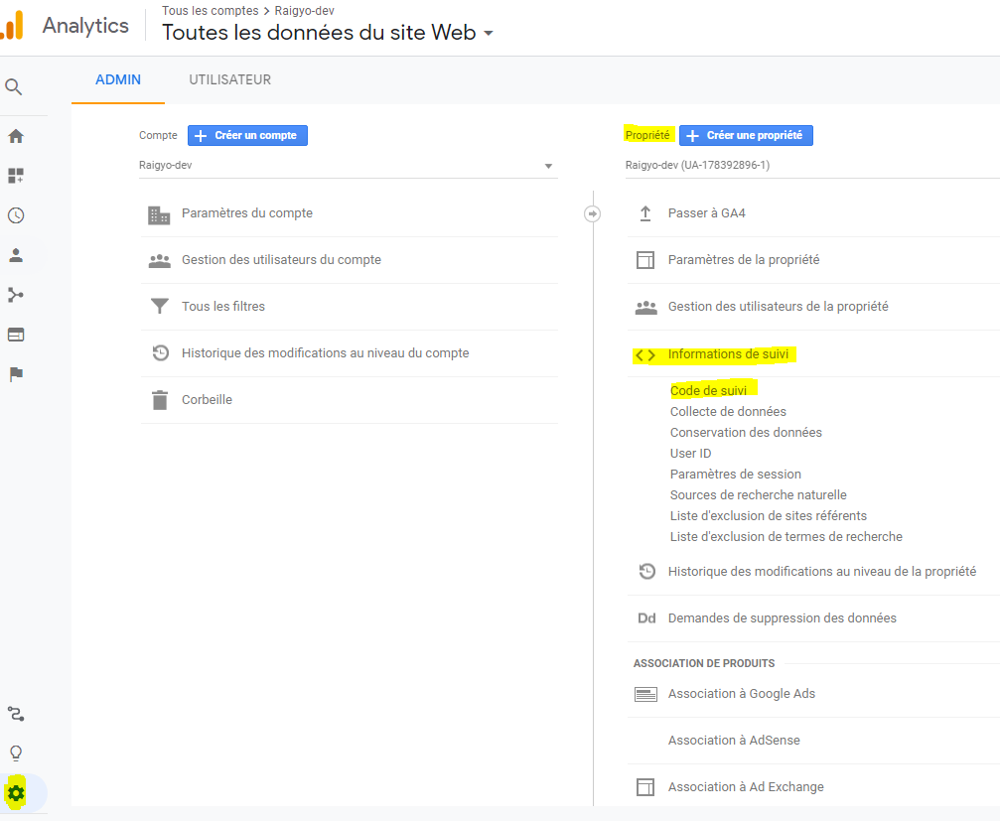

Copier la partie encadrée sur **toutes** les pages du site web, dans la balise head, en premier lieu:

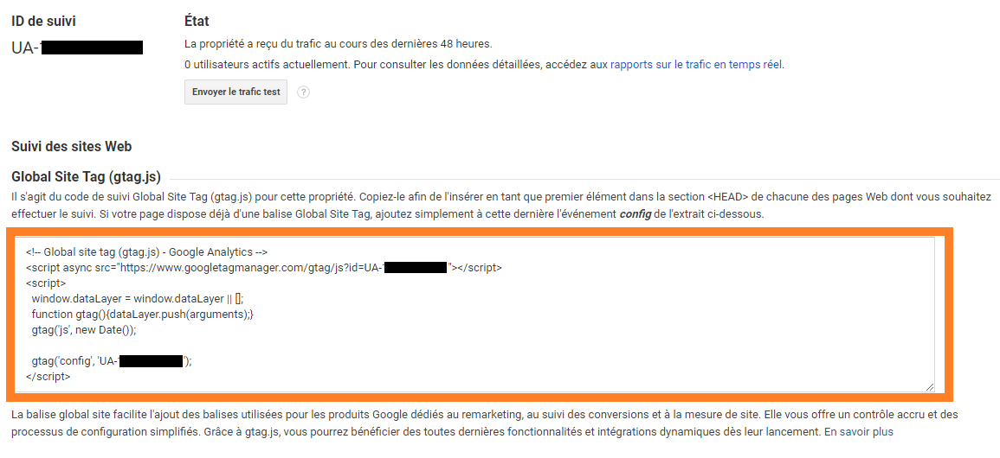

````html
  <head>
  	<!-- Global site tag (gtag.js) - Google Analytics -->
    <script async src="https://www.googletagmanager.com/gtag/js?id=UA-XXXXXXXXX-X"></script>
    <script>
      window.dataLayer = window.dataLayer || [];
      function gtag(){dataLayer.push(arguments);}
      gtag('js', new Date());

      gtag('config', 'UA-XXXXXXXXX-X');
    </script>
    <!-- OTHER TAGS -->
    <meta charset="UTF-8">
    <meta name="language" content="english">
    <meta name="viewport" content="width=device-width, initial-scale=1.0">
	<!-- .... -->
  </head>
````

### Intégration de GA dans Wordpress

Peut se faire facilement via une extension.

Dans la partie administration du site, sélectionner plugins/extensions => ajouter.

Dans les mots clés, une recherche sur 'google-analytics'.

Il existe plusieurs plugins. Un des plus performants est celui de [Monster Insights]().

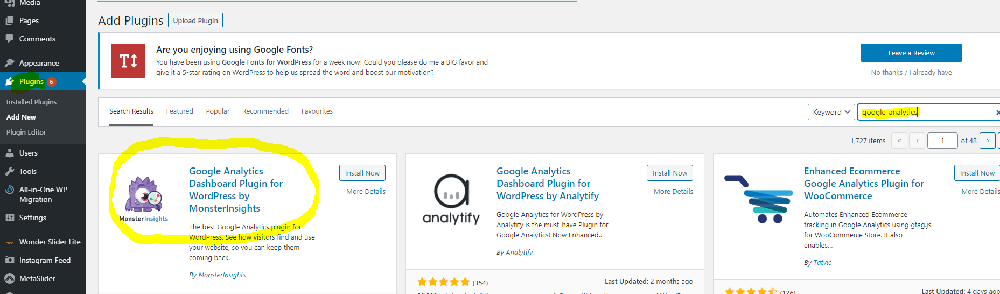

Après l'installation il faut l'activer:

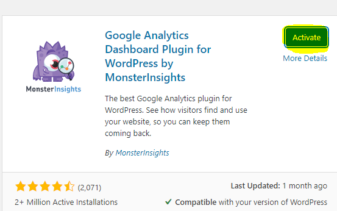

Suivre les instructions de l'assistant.

Il faut le lier au compte Google sur lequel a été créé la propriété.

Pour des raisons évidentes, le plugin ne fonctionnera pas en local. Certaines fonctionnalités avancées sont payantes.

### Intégration de GA dans Drupal

Dans l'interface d'admin de Drupal, allez sur Extensions/Extend => Ajouter nouvelle extension (module).

Télécharger le module Google Analytics depuis l'url suivante: https://www.drupal.org/project/google_analytics ou copier l'url de téléchargement.

En fonction du choix, encoder l'url ou télécharger le module.

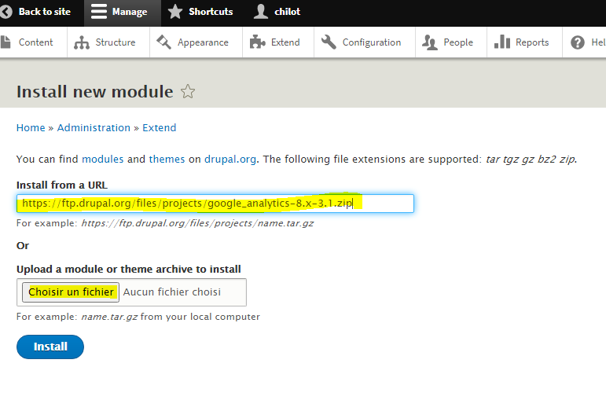

Activer le module.

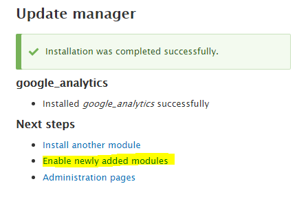

Dans la page: admin/modules, activer le module en le sélectionnant et en cliquant sur installer.

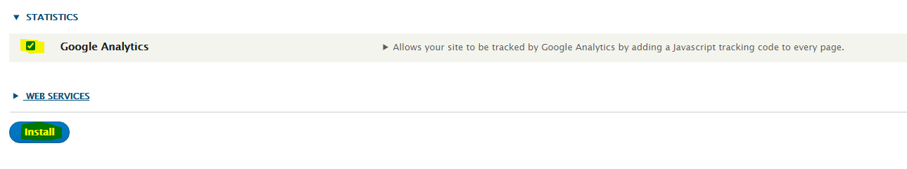

Dans admin/config, la gestion de GA a été ajoutée.


Ouvrir la page admin/config/system/google-analytics

Se rendre dans GA et:

Dans le menu de gauche: Administration (icone engrenage)

Menu central: propriété => Informations de suivi => Code de suivi

Copier le code de suivi:


Coller le code dans Drupal dans la case prévue à cet effet et renseigner l'url du site. Il est possible de tester en local ou d'avoir des sous-domaines.

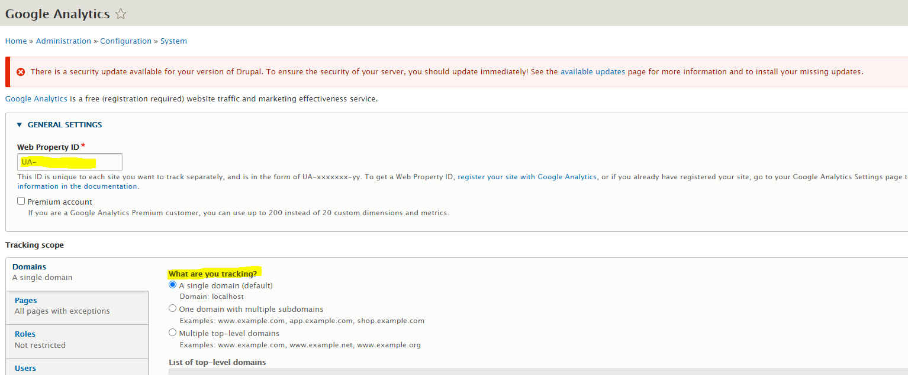


En bas de la page à gauche, cliquer sur 'Sauver la configuration'.

Dans admin/config/development/performance, il faudra nettoyer le chahe puis sauver.

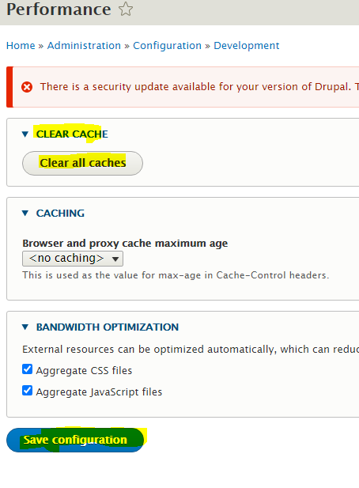

### Intégration de GA sur Prestashop

Installer le module officiel: modules/modules et services => catalogue de modules => rechercher 'google-analytics" => installer

Il s'agit d'un module développé par Prestashop.


Ensuite: configurer

Se rendre dans GA et:

Dans le menu de gauche: Administration (icone engrenage)

Menu central: propriété => Informations de suivi => Code de suivi

Copier le code de suivi:


Et copier l'identifiant dans la case "ID de tracking Google Analytics".


Il est recommandé de sélectionner de **rendre les adresses IP anonymes** pour rester en règles avec la GDPR.

### Intégration de GA sur Shopify

Se rendre dans GA et:

Dans le menu de gauche: Administration (icone engrenage)

Menu central: propriété => Informations de suivi => Code de suivi

Copier le contenu de la partie encadrée:


Dans Shopify aller dans Boutique en ligne => Préférences.

Scroller jusqu'à 'Google Analytics' puis dans le champ 'Compte Google Analytics', copier le code provenant du site GA, puis cliquer sur enregistrer.

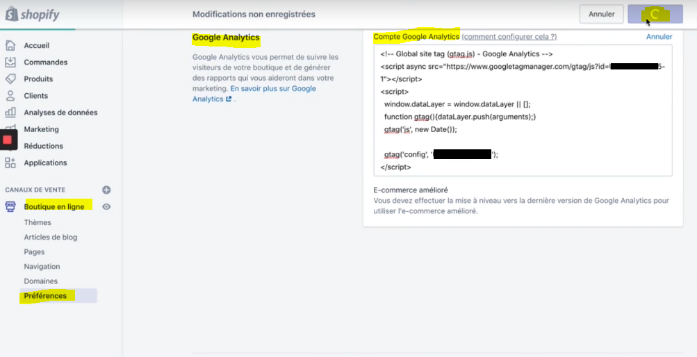

### Vérifier que GA est bien installé

Il est nécessaire d'utiliser un autre appareil pour se connecter au site que celui qui est utilisé pour consulter GA, par exemple un smartphone.

En effet,  GA va repérer que c'est la même machine utilisée et donc ne va pas comptabiliser la visite afin de ne pas prendre en compte les visites de la personne faisant l'audit du site web.

Si tout a bien fonctionné, l'on peut apercevoir notre connexion dans la rubrique temps réel / vue d'ensemble:


Si ce n'est pas le cas revoir les procédures d'intégration afin d'identifier ce qui n'a pas fonctionné.

Egalement il est utile de vérifier que toutes les pages du site qu'on veut auditer sont bien prises en compte.

## Lier GA à d'autres comptes

### Google Search Console

#### Créer un compte 

Par défaut GA mesure le trafic sur le site. La google search console va permettre de suivre le trafic en provenance du moteur de recherche Google.

Créer son compte: https://search.google.com/search-console

Pour des raisons de facilité, il est préférable que le compte Google utilisé pour l'inscription à ce service soit le même que celui pour l'inscription à GA. Dans le cas contraire il y aura une série de validations qui seront proposées pour lier les comptes.

Il est possible de créer une configuration pour tout un domaine.

Dans le cas du suivi d'un seul site, privilégier la seconde option, via préfixe de l'url. Il suffit d'introduite l'url du site à auditer. 

Ne pas oublier le 's' du 'https'. Car l'outil ne va pas convertir.


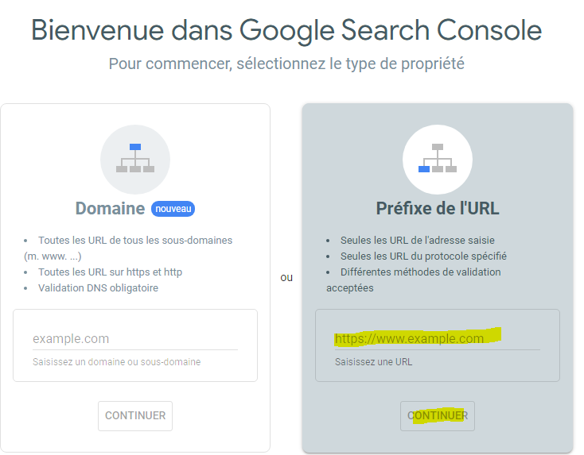

Si l'audit se fait sur le même site que celui de GA, la fenêtre suivante devrait apparaître.

Cliquer sur valider la propriété.

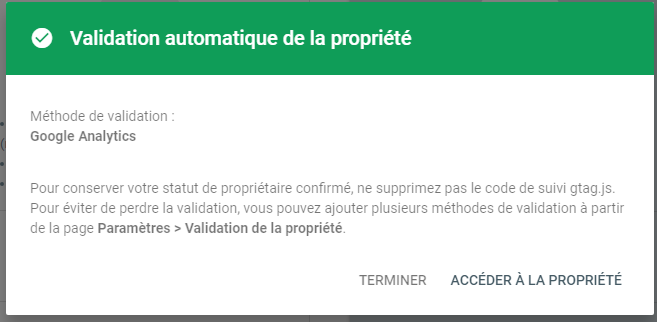

Si le site est différent, il sera proposé d'insérer à nouveau du code sur chaque page afin de vérifier que la personne souscrivant au service est bien le propriétaire du site (comme pour GA). Les deux services peuvent être utilisés indépendamment.

Au début il n'y aura aucune données et il faudra attendre quelques jours avant de les voir apparaitre.

#### Lier GA à Google Search Console

Le service ne sera pas lié automatiquement même s'il a été créé avec le même compte.

Il faut aller dans la partie administration (menu de gauche tout en bas), sélectionner 'tous les produits' et enfin 'search console'.

Cliquer sur 'Associer la Search Console'.


Puis cliquer sur 'Ajouter'.

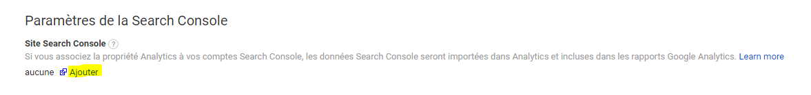

Ensuite sélectionner l'url du site à associer (il pourrait y en avoir plusieurs dans la search console).

Cliquer sur enregistrer et confirmer une nouvelle fois dans le fenêtre modale qui s'ouvre ensuite.

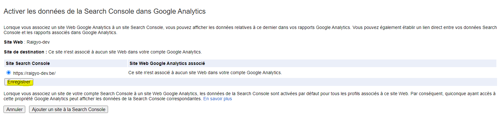

Pour vérifier, retourner dans Administration / Tous les produits.

Search console devrait apparaître en haut. Cliquer sur 'Paramétrer l'association'.

La vue devrait être activée.


Pour vérifier et faire le suivi, depuis le dashboard: Acquisition / Search Console / Pages de destination.

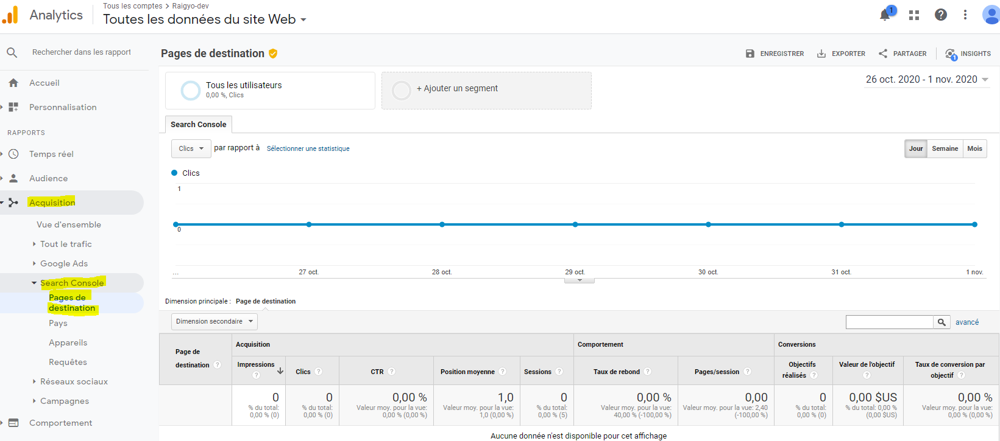

Au début il n'y aura aucune données et il faudra attendre quelques jours avant de les voir apparaitre.

### Google Ads

#### Lier GA à Google Ads

Aller dans Acquisition / Google Ads / Campagnes, puis 'associer vos comptes'.


Les compte Google Ads associés au même compte utilisateur seront listées. Sélectionner les Campagnes à auditer.

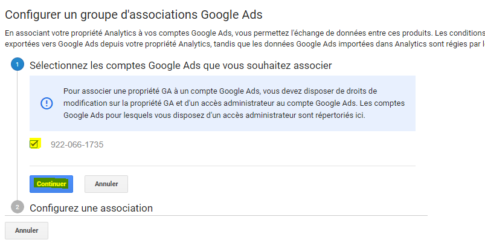

Créer un nom pour l'association, activer 'Toutes les données du site web'.

Puis 'Associer les comptes'. Cela prendra 24h avant d'être activé.


### Donner l'accès à d'autres utilisateurs

Permet de donner des accès au compte GA à un collaborateur, un associé, un client, un prestataire...

Il est possible de donner des accès à plusieurs niveaux: Compte, Propriété, Vue.

- Compte: accès à toutes les fonctionnalités, propriétés et vues.

- Propriété: accès à la gestion d'un site en particulier.
- Vue: permet de sélectionner juste une certaine partie des statistiques visible pour un utilisateur donné. On peut créer plusieurs type vues.

Dans administration.


Quel que soit le niveau choisi, c'est le même schéma.

On peut ajouter un ou plusieurs utilisateurs.


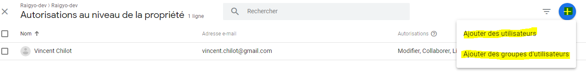

Ensuite, on peut affiner les droits.

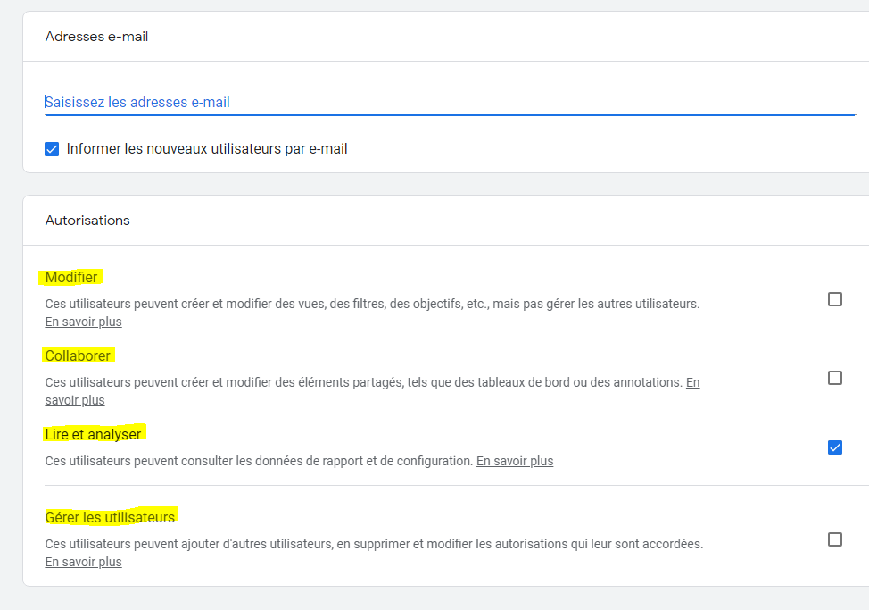

Lorsque l'on donne les droits à un utilisateur, ne pas oublier de supprimer cet utilisateur si celui-ci n'est pas plus habilité à accéder aux données (fin de contrat, départ de collaborateur...).


## Comment analyser les données?


## Liens utiles / sources

- [Formation Udemy](https://www.udemy.com/course/google-analytics-trafic/)


