# Tout comprendre de Google Analytics et analyser son trafic !


## Introduction

### Pourquoi utiliser Google Analytics (GA) ?

- Suivre l'évolution de sa stratégie d'acquisition de trafic: d'où viennent les utilisateur, par quel canal...
- Comprendre qui sont nos visiteurs, leur comportement: est-ce que les cibles sont les bonnes, doit-on ajuster la stratégie...
- Améliorer le taux de conversion (achat, génération de leads/prospects) de son site internet: d'où viennent les leads, choix des canaux de diffusion en fonction du retour sur investissement, analyser les moyens de conversion depuis un même canal (publicité, partages naturels, repartages...)

### Pour qui est fait GA?

Pour tout type d'entreprise et même toute personne voulant suivre son trafic (blog, portfolio...).

## Créer son compte et intégrer son site

### Créer son compte

Un compte Google est nécessaire: https://analytics.google.com/

Un même compte peut permettre de tracker plusieurs sites. L'on peut ajouter des propriétés par après (une propriété = un produit: site, application mobile) .

Bien veiller à sélectionner le bon fuseau horaire.

### Intégration de GA sur son application web HTML

Dans le menu de gauche: Administration (icone engrenage)

Menu central: propriété => Informations de suivi => Code de suivi


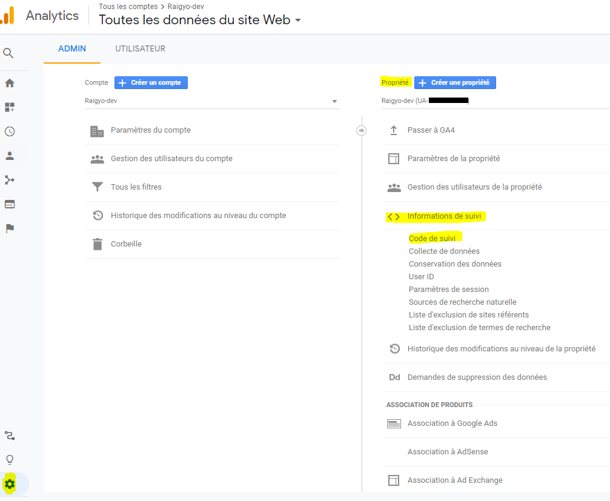

Copier la partie encadrée sur **toutes** les pages du site web, dans la balise head, en premier lieu:


````html
  <head>
  	<!-- Global site tag (gtag.js) - Google Analytics -->
    <script async src="https://www.googletagmanager.com/gtag/js?id=UA-XXXXXXXXX-X"></script>
    <script>
      window.dataLayer = window.dataLayer || [];
      function gtag(){dataLayer.push(arguments);}
      gtag('js', new Date());

      gtag('config', 'UA-XXXXXXXXX-X');
    </script>
    <!-- OTHER TAGS -->
    <meta charset="UTF-8">
    <meta name="language" content="english">
    <meta name="viewport" content="width=device-width, initial-scale=1.0">
	<!-- .... -->
  </head>
````

### Intégration de GA dans Wordpress

Peut se faire facilement via une extension.

Dans la partie administration du site, sélectionner plugins/extensions => ajouter.

Dans les mots clés, une recherche sur 'googleAnalytics'.

Il existe plusieurs plugins. Un des plus performants est celui de [Monster Insights]().

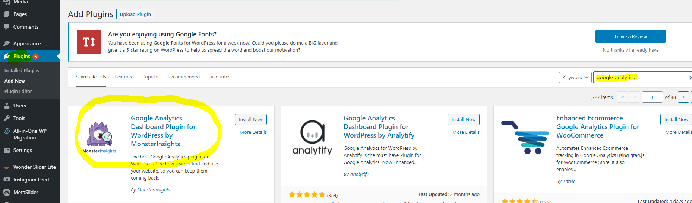

Après l'installation il faut l'activer:

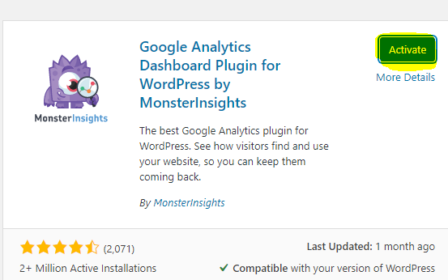

Suivre les instructions de l'assistant.

Il faut le lier au compte Google sur lequel a été créé la propriété.

Pour des raisons évidentes, le plugin ne fonctionnera pas en local. Certaines fonctionnalités avancées sont payantes.

### Intégration de GA dans Drupal

Dans l'interface d'admin de Drupal, allez sur Extensions/Extend => Ajouter nouvelle extension (module).

Télécharger le module Google Analytics depuis l'url suivante: https://www.drupal.org/project/google_analytics ou copier l'url de téléchargement.

En fonction du choix, encoder l'url ou télécharger le module.


Activer le module.


Dans la page: admin/modules, activer le module en le sélectionnant et en cliquant sur installer.


Dans admin/config, la gestion de GA a été ajoutée.

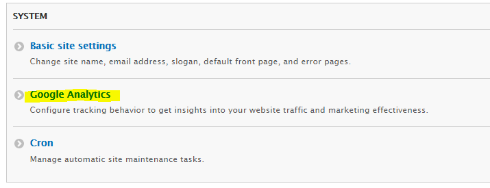


Ouvrir la page admin/config/system/googleAnalytics

Se rendre dans GA et:

Dans le menu de gauche: Administration (icone engrenage)

Menu central: propriété => Informations de suivi => Code de suivi

Copier le code de suivi:

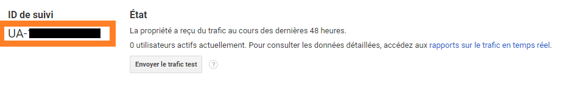

Coller le code dans Drupal dans la case prévue à cet effet et renseigner l'url du site. Il est possible de tester en local ou d'avoir des sous-domaines.

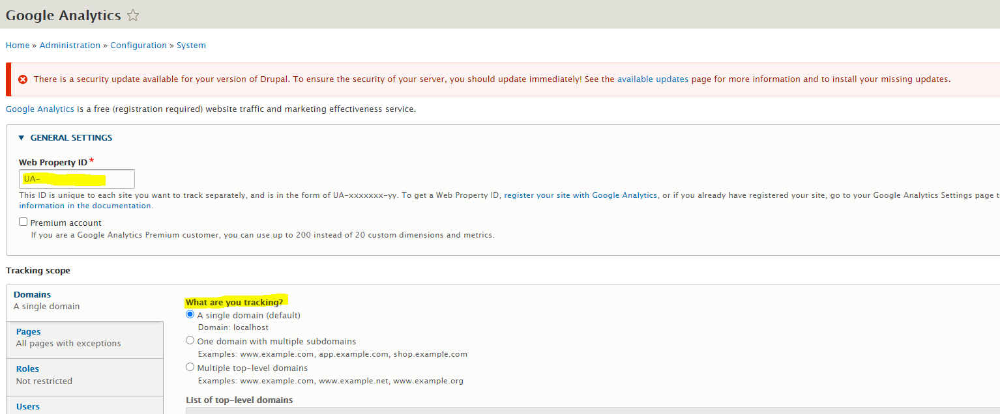


En bas de la page à gauche, cliquer sur 'Sauver la configuration'.

Dans admin/config/development/performance, il faudra nettoyer le chahe puis sauver.


### Intégration de GA sur Prestashop

Installer le module officiel: modules/modules et services => catalogue de modules => rechercher 'googleAnalytics" => installer

Il s'agit d'un module développé par Prestashop.

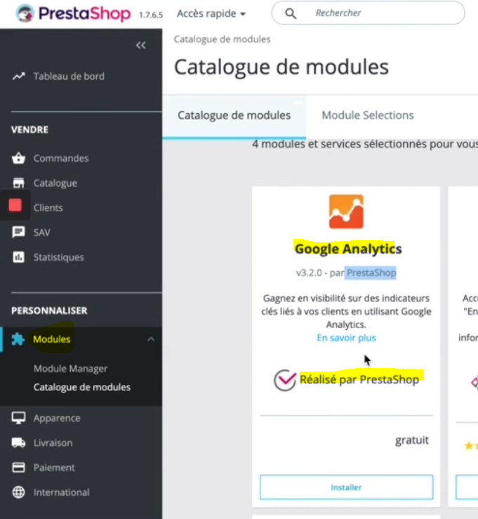

Ensuite: configurer

Se rendre dans GA et:

Dans le menu de gauche: Administration (icone engrenage)

Menu central: propriété => Informations de suivi => Code de suivi

Copier le code de suivi:


Et copier l'identifiant dans la case "ID de tracking Google Analytics".

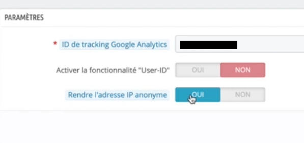

Il est recommandé de sélectionner de **rendre les adresses IP anonymes** pour rester en règles avec la GDPR.

### Intégration de GA sur Shopify

Se rendre dans GA et:

Dans le menu de gauche: Administration (icone engrenage)

Menu central: propriété => Informations de suivi => Code de suivi

Copier le contenu de la partie encadrée:


Dans Shopify aller dans Boutique en ligne => Préférences.

Scroller jusqu'à 'Google Analytics' puis dans le champ 'Compte Google Analytics', copier le code provenant du site GA, puis cliquer sur enregistrer.

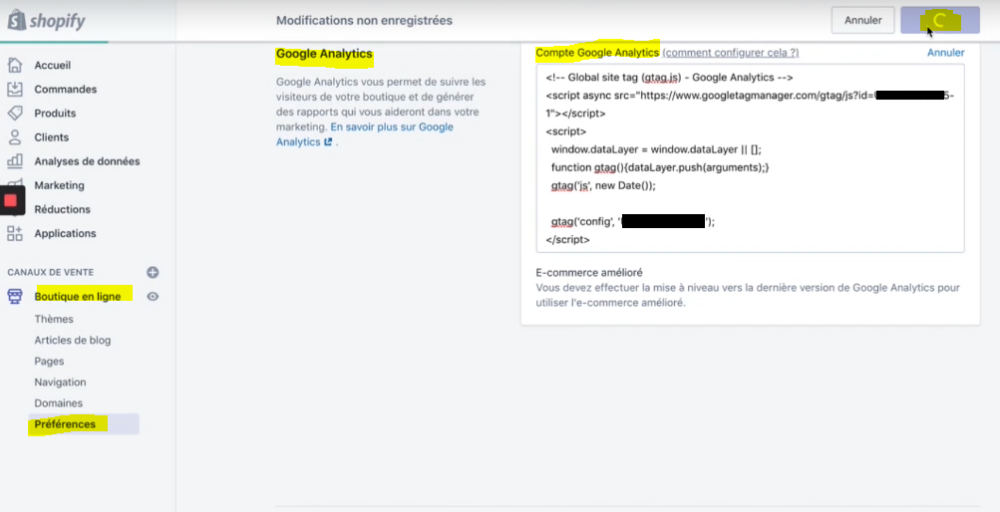

### Vérifier que GA est bien installé

Il est nécessaire d'utiliser un autre appareil pour se connecter au site que celui qui est utilisé pour consulter GA, par exemple un smartphone.

En effet,  GA va repérer que c'est la même machine utilisée et donc ne va pas comptabiliser la visite afin de ne pas prendre en compte les visites de la personne faisant l'audit du site web.

Si tout a bien fonctionné, l'on peut apercevoir notre connexion dans la rubrique temps réel / vue d'ensemble:

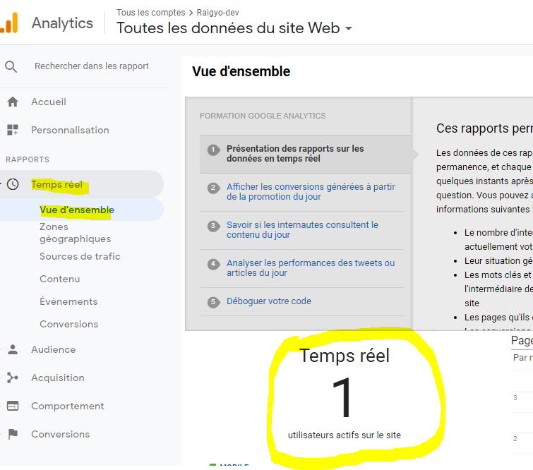

Si ce n'est pas le cas revoir les procédures d'intégration afin d'identifier ce qui n'a pas fonctionné.

Egalement il est utile de vérifier que toutes les pages du site qu'on veut auditer sont bien prises en compte.

## Lier GA à d'autres comptes

### Google Search Console

#### Créer un compte 

Par défaut GA mesure le trafic sur le site. La google search console va permettre de suivre le trafic en provenance du moteur de recherche Google.

Créer son compte: https://search.google.com/search-console

Pour des raisons de facilité, il est préférable que le compte Google utilisé pour l'inscription à ce service soit le même que celui pour l'inscription à GA. Dans le cas contraire il y aura une série de validations qui seront proposées pour lier les comptes.

Il est possible de créer une configuration pour tout un domaine.

Dans le cas du suivi d'un seul site, privilégier la seconde option, via préfixe de l'url. Il suffit d'introduite l'url du site à auditer. 

Ne pas oublier le 's' du 'https'. Car l'outil ne va pas convertir.


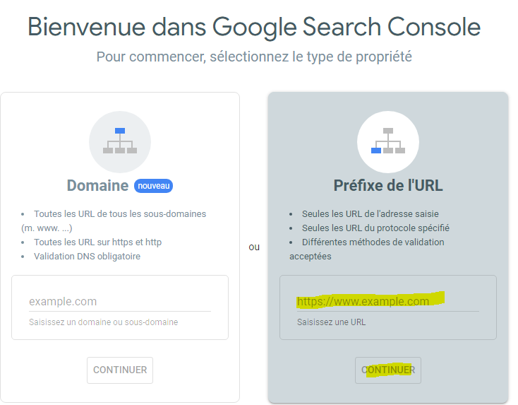

Si l'audit se fait sur le même site que celui de GA, la fenêtre suivante devrait apparaître.

Cliquer sur valider la propriété.


Si le site est différent, il sera proposé d'insérer à nouveau du code sur chaque page afin de vérifier que la personne souscrivant au service est bien le propriétaire du site (comme pour GA). Les deux services peuvent être utilisés indépendamment.

Au début il n'y aura aucune données et il faudra attendre quelques jours avant de les voir apparaitre.

#### Lier GA à Google Search Console

Le service ne sera pas lié automatiquement même s'il a été créé avec le même compte.

Il faut aller dans la partie administration (menu de gauche tout en bas), sélectionner 'tous les produits' et enfin 'search console'.

Cliquer sur 'Associer la Search Console'.

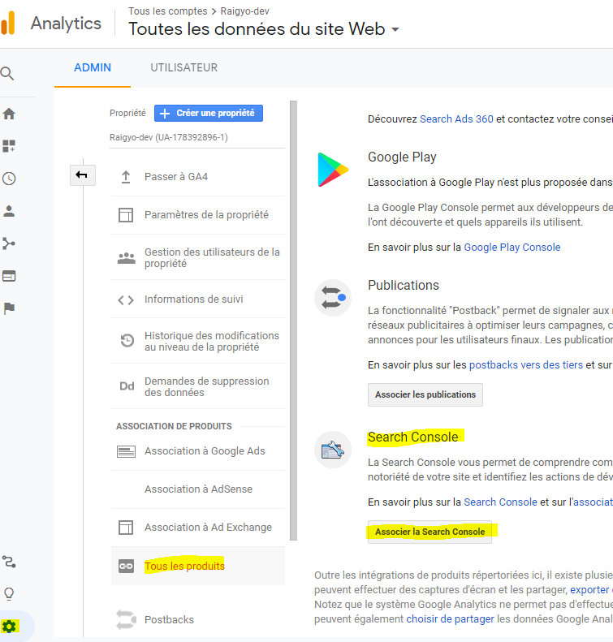


Puis cliquer sur 'Ajouter'.


Ensuite sélectionner l'url du site à associer (il pourrait y en avoir plusieurs dans la search console).

Cliquer sur enregistrer et confirmer une nouvelle fois dans le fenêtre modale qui s'ouvre ensuite.


Pour vérifier, retourner dans Administration / Tous les produits.

Search console devrait apparaître en haut. Cliquer sur 'Paramétrer l'association'.

La vue devrait être activée.

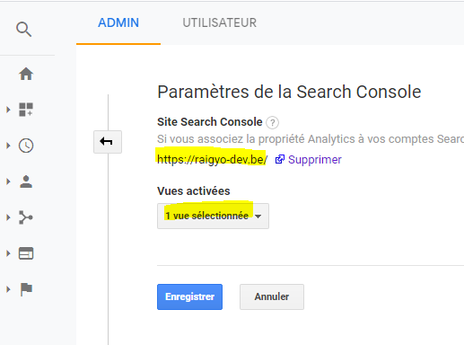


Pour vérifier et faire le suivi, depuis le dashboard: Acquisition / Search Console / Pages de destination.

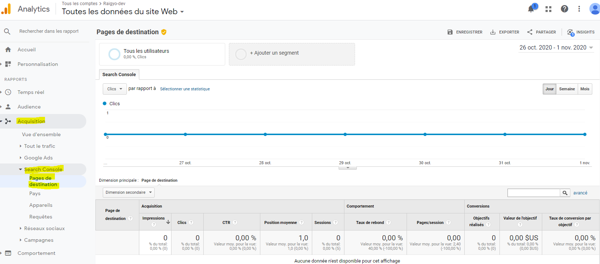

Au début il n'y aura aucune données et il faudra attendre quelques jours avant de les voir apparaitre.

### Google Ads

#### Lier GA à Google Ads

Aller dans Acquisition / Google Ads / Campagnes, puis 'associer vos comptes'.


Les compte Google Ads associés au même compte utilisateur seront listées. Sélectionner les Campagnes à auditer.

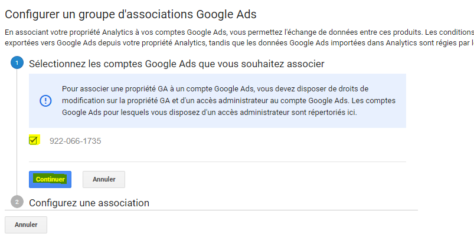

Créer un nom pour l'association, activer 'Toutes les données du site web'.

Puis 'Associer les comptes'. Cela prendra 24h avant d'être activé.

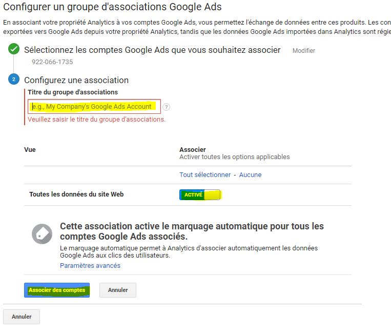

### Donner l'accès à d'autres utilisateurs

Permet de donner des accès au compte GA à un collaborateur, un associé, un client, un prestataire...

Il est possible de donner des accès à plusieurs niveaux: Compte, Propriété, Vue.

- Compte: accès à toutes les fonctionnalités, propriétés et vues.

- Propriété: accès à la gestion d'un site en particulier.
- Vue: permet de sélectionner juste une certaine partie des statistiques visible pour un utilisateur donné. On peut créer plusieurs type vues.

Dans administration.

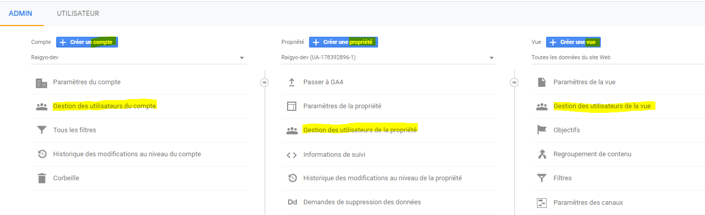

Quel que soit le niveau choisi, c'est le même schéma.

On peut ajouter un ou plusieurs utilisateurs.


Ensuite, on peut affiner les droits.

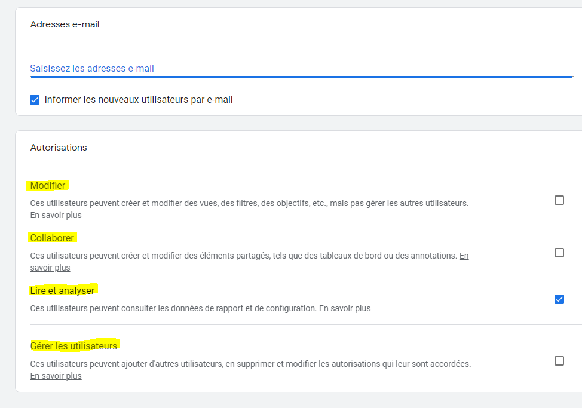

Lorsque l'on donne les droits à un utilisateur, ne pas oublier de supprimer cet utilisateur si celui-ci n'est pas plus habilité à accéder aux données (fin de contrat, départ de collaborateur...).

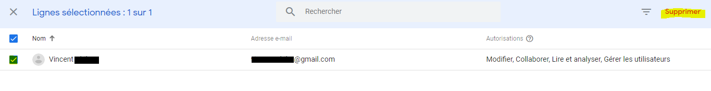

## Comment analyser les données?

### Quelles sont les types de données qu'il est possible d'analyser?

- L'audience: quel est le profil de nos visiteurs?
- Comparer les différents canaux d'acquisition de trafic
- Analyser le comportement pour améliorer l'expéreince utilisateur

### Glossaire et définitions

**Engagement / taux d'engagement**: L'engagement en marketing dépend de plusieurs paramètres, il correspond à une notion qui désigne les prédispositions du consommateur à interagir avec un élément marketing ou une marque. Internet favorise grandement les interactions entre les consommateurs et les marques, on compte ainsi différentes formes d'engagements de la part des internautes. Le client potentiel peut s'engager suite à la réception d'un message publicitaire visuel, d'une newsletter, d'un e-mail, directement auprès de la marque ou via les réseaux sociaux par exemple. Les professionnels mesurent ensuite le taux d'engagement. On peut considérer qu'il existe plusieurs niveaux d'engagement : l'engagement simple, qui dénote un intérêt pour une marque, l'engagement pour l'achat, qui entraîne le consommateur à se renseigner davantage sur un produit spécifique et l'engagement viral qui concerne les consommateurs satisfaits, communiquant volontiers sur leurs marques favorites. L'engagement permet à la fois de fidéliser la clientèle, d'accroître la notoriété et d'échanger plus facilement avec les consommateurs.

**Session**: une session représente la visite d'un internaute (utilisateur) sur votre site web. La session englobe toutes l'activité que l'internaute effectue sur notre site et cette activité est limitée dans le temps. Après 30 minutes d'inactivité, la session prend fin. Si l'utilisateur reprend son activité après ces 30 minutes, cela sera considéré comme une seconde session. Un utilisateur peut donc avoir plusieurs sessions.

**Utilisateur**: un utilisateur est un internaute qui utilise notre site web. Ce dernier peut être assimilé à plusieurs sessions s'il a été inactif plus de 30 minutes. Un utilisateurs utilisant des appareils différents pour se connecter au site sera considéré comme plusieurs utilisateurs différents.

**Page vue**: une page vue représente le nombre de fouis qu'un visiteur a vu une page spécifique. Cela ne veut pas dire qu'il a vu toute la page ou qu'il l'a concidérée avec intérêt, mais qu'elle a été gée dans le navigateur. Ainsi le nombre de pages vues représentera le nombre total de pages consultées sur notre site web. Si une même page est vue deux fois, cela sera considéré comme deux pages vues.

**Page par session**: une page par session représente le nombre moyen de pages vues au cours d'une même session. Ainsi, si  utilisateur visite notre site web et consulte plusieurs pages différentes, il s'agira du nombre de pages par session. Sur GA, on retrouve donc une moyenne deges visitées par session, et ce, par tous les utilisateurs.

**Durée moyenne des sessions**: une session représente la période pendant laquelle un utilisateur est actif sur un site web. Ainsi la durée moyenne des sessions donne une idée du temps passé par session en moyenne sur notre site web. Permet de mesurer le taux d'engagement (engagement Rate).

**% de nouvelles sessions**: le pourcentage de nouvelles sessions représente le pourcentage des nouvelles visites sur notre site, des utilisateurs qui le consultent pour la première fois. De cette manière l'on peut déterminer si l'on attire des utilisateurs qui visitent notre site web pour la première fois ou, si à l'inverse l'on attire des utilisateurs qui ont déjà visité notre site et y reviennent.

**Taux de rebond**:  le taux de rebond représente le pourcentage de visites pendant lesquelles l'utilisateur a quitté le site web dès sa page d'arrivée, sans même interagir avec la page en question (bien que l'utilisateur ait peut-être lu toute la page). Ce n'est pas alarmant car il est normal qu'un utilisateur constate qu'il n'est pas sur un site qui correspond à sa recherche et s'en aille. Cependant si un taux de rebond est élevé, c'est préoccupant. Cela signifie que la page en question pourrait peut-être être améliorée ou encore, que la campagne qui a mené l'utilisateur sur cette page n'était pas assez claire.

**Canaux**: les canaux d'acquisition sont les sources du trafic de notre site (moteur de recherche, référencement naturel...). En les analysant, nous pouvons les regrouper par segments d'activités marketing: trafic provenant des réseaux sociaux, du SEO, emailing, campagnes publicitaires...

**Trafic organique**: le trafic organique est celui provenant des résultats naturels des moteurs de recherche comme Google, Bing, Yahoo... Ces résultats sont liés au référencement naturel SEO de notre site.

**SEO / Référencement nature**l:  SEO est l'acronyme de Search Engine Optimization et peut être défini comme l'art de positionner un site, une page web ou une application dans les premiers résultats naturels des moteurs de recherche. En français, le SEO est désigné par le terme de référencement naturel. Sur les requêtes visées, la position obtenue se doit essentiellement d'être en première page, car lors de la majeure partie des requêtes, c'est la seule page consultée. Désormais, il peut même s'agir d'obtenir la position zéro. La position zéro est un résultat de recherche positionné devant le premier résultat naturel sur Google. Elle est matérialisée par un bloc contenant les éléments d’une page web répondant à une question posée, on parle d’ « extrait optimisé ou featured snippet  ». La position zéro permet donc à Google de répondre directement à une question posée par un internaute, le plus souvent lors d’une recherche vocale effectuée sur Smartphone. Les termes position #0 ou ranking #0 désignent également une position zéro.

**Trafic référent**: le trafic référent est celui qui provient d'autres sites internets qui ne sont pas des réseaux sociaux (autres sites, blogs qui parlent de notre site et fournissent son lien).

**Trafic social**: le trafic social est celui provenant des réseaux sociaux (Facebook, Twitter, Instagram, linkedIn, Pinterest) et qui n'est pas associé à une publicité, c'est un trafic organique. Il peut cependant être organisé avec la collaboration d'influenceurs. Il permet de voir quel réseau social nous envoie le plus de visiteurs.

**Trafic payant / paid trafic**:  le trafic payé est celui obtenu via le réseau de recherche Google Ads, Bing Ads ou d'autres moteurs de recherche au moyen d'une campagne de coûts par clic (CPC). Cela inclus également les campagnes marketingpublicitaires payantes sur les réseaux sociaux.

**Trafic direct**: le trafic direct est celui de toutes les sessions qui proviennent d'un utilisateur qui a saisi l'adresse de notre site directement dans la barre de recherche de son navigateur ou qui l'a placé dans sa sections 'favoris'. Il s'agit souvent d'internautes récurrents qui connaissent bien notre site.

**Événements**: les événements représentent les interactions d'un utilisateur avec un contenu. Il existe plusieurs types d'actions ou d'interactions que l'on peut suivre tels que les téléchargements, les lectures vidéo, les clics sur une annonce, remplir un formulaire, etc.

**Conversion**:  une conversion représente une action réalisée en ligne ou hors ligne et qui est primordiale pour atteindre les objectifs de l'entreprise. il s'agit par exemple d'un achat dans la boutique, une demande de formulaire de devis... Mais cela peut être plus pointu, comme fidéliser le visiteur à un service en démonstartion de façon récurrente et prolongée.

**Taux de conversion**: pourcentage de visiteurs ayant fait une conversion. Le taux de conversion sur GA est intimement lié aux objectifs de conversion. En effet, ce taux permet de connaître le pourcentage de visites ayant abouti à une conversion et ce, en lien avec un objectif configuré.

### Comment analyser les données en fonction d'une période donnée?


## Liens utiles / sources

- [Formation Udemy: Tout comprendre de Google Analytics et analyser son trafic !](https://www.udemy.com/course/googleAnalytics-trafic/)
- [emarketing.fr](https://www.e-marketing.fr/)
- [Définitions marketing](https://www.definitions-marketing.com/)
- [anthedesign](https://www.anthedesign.fr/)


