# Tout comprendre de Google Analytics et analyser son trafic !


```markdown
| Project: Google Analytics Overview  |  Document type: Procedure | Author: Vincent Chilot |  Last revision: 15/11/2020 |   
```


Cette procédure aide à avoir une vue d'ensemble sur l'interface de Google Analytics (GA) et à implémenter le suivi analytique dans les services web.

Cette procédure est une synthèse de la formation "[Tout comprendre de Google Analytics et analyser son trafic !](https://www.udemy.com/course/google-analytics-trafic/)" par Guillaume Guersan, consultant Freelance en Marketing Digital.

Cette procédure s'adresse à des personnes ayant des connaissances : 

- en développement pour l'implémentation dans les services web
- en marketing pour analyser les résultats et adapter des stratégies

**Prérequis nécessaire** : posséder un compte Google, la présente procédure indiquera la marche à suivre pour créer un compte Google Analytics et Google search Console.

**Conseillé** : posséder un site ou un service ou pourra être implémenté GA / un site ayant déjà GA implémenté.

**Facultatif** : posséder un compte Google Ads.

## Table des matières

  * [Introduction](#introduction)
    + [Pourquoi utiliser Google Analytics (GA) ?](#pourquoi-utiliser-google-analytics--ga---)
    + [Pour qui est fait GA?](#pour-qui-est-fait-ga-)
  * [Créer son compte et intégrer son site](#cr-er-son-compte-et-int-grer-son-site)
    + [Créer son compte](#cr-er-son-compte)
    + [Intégration de GA sur son application web HTML](#int-gration-de-ga-sur-son-application-web-html)
    + [Intégration de GA dans Wordpress](#int-gration-de-ga-dans-wordpress)
    + [Intégration de GA dans Drupal](#int-gration-de-ga-dans-drupal)
    + [Intégration de GA sur Prestashop](#int-gration-de-ga-sur-prestashop)
    + [Intégration de GA sur Shopify](#int-gration-de-ga-sur-shopify)
    + [Vérifier que GA est bien installé](#v-rifier-que-ga-est-bien-install-)
  * [Lier GA à d'autres comptes](#lier-ga---d-autres-comptes)
    + [Google Search Console](#google-search-console)
      - [Créer un compte](#cr-er-un-compte)
      - [Lier GA à Google Search Console](#lier-ga---google-search-console)
    + [Google Ads](#google-ads)
      - [Lier GA à Google Ads](#lier-ga---google-ads)
    + [Donner l'accès à d'autres utilisateurs](#donner-l-acc-s---d-autres-utilisateurs)
  * [Comment analyser les données?](#comment-analyser-les-donn-es-)
    + [Quelles sont les types de données qu'il est possible d'analyser?](#quelles-sont-les-types-de-donn-es-qu-il-est-possible-d-analyser-)
    + [Glossaire et définitions](#glossaire-et-d-finitions)
    + [Comment analyser les données en fonction d'une période donnée?](#comment-analyser-les-donn-es-en-fonction-d-une-p-riode-donn-e-)
  * [Analyser l'audience et acquérir de nouveaux clients](#analyser-l-audience-et-acqu-rir-de-nouveaux-clients)
    + [La vue d'ensemble de notre audience](#la-vue-d-ensemble-de-notre-audience)
    + [Analyser les données démographiques](#analyser-les-donn-es-d-mographiques)
      - [Age et sexe](#age-et-sexe)
    + [Analyser les données géographiques](#analyser-les-donn-es-g-ographiques)
      - [Données linguistiques](#donn-es-linguistiques)
      - [Données de la zone géographique](#donn-es-de-la-zone-g-ographique)
    + [Engagement des visiteurs](#engagement-des-visiteurs)
      - [Visiteurs nouveaux / connus](#visiteurs-nouveaux---connus)
      - [Fréquence et récence](#fr-quence-et-r-cence)
      - [Engagement](#engagement)
        * [Segment de durée de la session](#segment-de-dur-e-de-la-session)
        * [Nombre de pages](#nombre-de-pages)
    + [Technologie utilisée par les visiteurs](#technologie-utilis-e-par-les-visiteurs)
      - [Navigateurs et OS](#navigateurs-et-os)
      - [Réseau](#r-seau)
    + [Appareils utilisés par nos visiteurs](#appareils-utilis-s-par-nos-visiteurs)
  * [Comparer les différents canaux d'acquisition de trafic](#comparer-les-diff-rents-canaux-d-acquisition-de-trafic)
    + [Vue d'ensemble des canaux d'acquisition](#vue-d-ensemble-des-canaux-d-acquisition)
    + [Impact des réseaux sociaux sur notre trafic](#impact-des-r-seaux-sociaux-sur-notre-trafic)
    + [Où en est notre optimisation de notre référencement naturel (SEO)?](#o--en-est-notre-optimisation-de-notre-r-f-rencement-naturel--seo--)
    + [Quels sites nous amènent du trafic?](#quels-sites-nous-am-nent-du-trafic-)
    + [Liens directs](#liens-directs)
    + [Analyser l'impact des campagnes publicitaires avec Google Ads](#analyser-l-impact-des-campagnes-publicitaires-avec-google-ads)
  * [Analyser le comportement pour améliorer l'expérience utilisateur](#analyser-le-comportement-pour-am-liorer-l-exp-rience-utilisateur)
    + [Contenu du site : quelles sont les pages les plus populaires](#contenu-du-site---quelles-sont-les-pages-les-plus-populaires)
    + [Vitesse du site : comprendre quelles sont les pages lentes de notre site](#vitesse-du-site---comprendre-quelles-sont-les-pages-lentes-de-notre-site)
    + [Site Search : trouver des opportunités avec notre moteur de recherche interne](#site-search---trouver-des-opportunit-s-avec-notre-moteur-de-recherche-interne)
    + [Évènements : analyser les actions de nos visiteurs](#-v-nements---analyser-les-actions-de-nos-visiteurs)
    + [Flux de comportement : analyser le parcours de nos visiteurs](#flux-de-comportement---analyser-le-parcours-de-nos-visiteurs)
  * [Tableau de bord et rapports email](#tableau-de-bord-et-rapports-email)
    + [Créer un tableau de bord](#cr-er-un-tableau-de-bord)
    + [Comparer les données entre deux périodes](#comparer-les-donn-es-entre-deux-p-riodes)
    + [Envoyer des rapports par email](#envoyer-des-rapports-par-email)
  * [Suivi d'événements, objectifs et taux de conversion](#suivi-d--v-nements--objectifs-et-taux-de-conversion)
    + [La notion d'événement](#la-notion-d--v-nement)
    + [Vérifier qu'un événement est bien suivi](#v-rifier-qu-un--v-nement-est-bien-suivi)
    + [Paramétrer des objectifs pour suivre son taux de conversion](#param-trer-des-objectifs-pour-suivre-son-taux-de-conversion)
    + [Analyse des conversions](#analyse-des-conversions)
  * [Liens utiles / sources](#liens-utiles---sources)

<small><i><a href='http://ecotrust-canada.github.io/markdown-toc/'>Table of contents generated with markdown-toc</a></i></small>


## Introduction

### Pourquoi utiliser Google Analytics (GA) ?

- Suivre l'évolution de sa stratégie d'acquisition de trafic: d'où viennent les utilisateur, par quel canal...
- Comprendre qui sont nos visiteurs, leur comportement: est-ce que les cibles sont les bonnes, doit-on ajuster la stratégie...
- Améliorer le taux de conversion (achat, génération de leads/prospects) de son site internet: d'où viennent les leads, choix des canaux de diffusion en fonction du retour sur investissement, analyser les moyens de conversion depuis un même canal (publicité, partages naturels, repartages...)

### Pour qui est fait GA?

Pour tout type d'entreprise et même toute personne voulant suivre son trafic (blog, portfolio...).

## Créer son compte et intégrer son site

### Créer son compte

Un compte Google est nécessaire: https://analytics.google.com/

Un même compte peut permettre de tracker plusieurs sites. L'on peut ajouter des propriétés par après (une propriété = un produit: site, application mobile) .

Bien veiller à sélectionner le bon fuseau horaire.

### Intégration de GA sur son application web HTML

Dans le menu de gauche: Administration (icone engrenage)

Menu central: propriété => Informations de suivi => Code de suivi


Copier la partie encadrée sur **toutes** les pages du site web, dans la balise head, en premier lieu:


````html
  <head>
  	<!-- Global site tag (gtag.js) - Google Analytics -->
    <script async src="https://www.googletagmanager.com/gtag/js?id=UA-XXXXXXXXX-X"></script>
    <script>
      window.dataLayer = window.dataLayer || [];
      function gtag(){dataLayer.push(arguments);}
      gtag('js', new Date());

      gtag('config', 'UA-XXXXXXXXX-X');
    </script>
    <!-- OTHER TAGS -->
    <meta charset="UTF-8">
    <meta name="language" content="english">
    <meta name="viewport" content="width=device-width, initial-scale=1.0">
	<!-- .... -->
  </head>
````

### Intégration de GA dans Wordpress

Peut se faire facilement via une extension.

Dans la partie administration du site, sélectionner plugins/extensions => ajouter.

Dans les mots clés, une recherche sur 'google analytics'.

Il existe plusieurs plugins. Un des plus performants est celui de [Monster Insights]().


Après l'installation il faut l'activer:


Suivre les instructions de l'assistant.

Il faut le lier au compte Google sur lequel a été créé la propriété.

Pour des raisons évidentes, le plugin ne fonctionnera pas en local. Certaines fonctionnalités avancées sont payantes.

### Intégration de GA dans Drupal

Dans l'interface d'admin de Drupal, allez sur Extensions / Extend => Ajouter nouvelle extension (module).

Télécharger le module Google Analytics depuis l'url suivante: https://www.drupal.org/project/google_analytics ou copier l'url de téléchargement.

En fonction du choix, encoder l'url ou télécharger le module.


Activer le module.

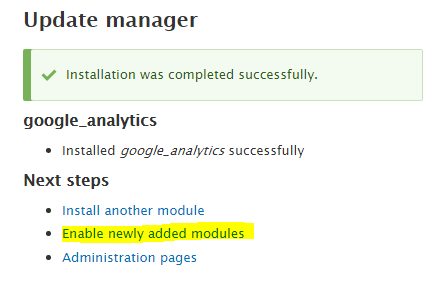

Dans la page: admin/modules, activer le module en le sélectionnant et en cliquant sur installer.


Dans admin/config, la gestion de GA a été ajoutée.


Ouvrir la page admin/config/system/googleAnalytics

Se rendre dans GA et:

Dans le menu de gauche: Administration (icone engrenage)

Menu central: propriété => Informations de suivi => Code de suivi

Copier le code de suivi:


Coller le code dans Drupal dans la case prévue à cet effet et renseigner l'url du site. Il est possible de tester en local ou d'avoir des sous-domaines.

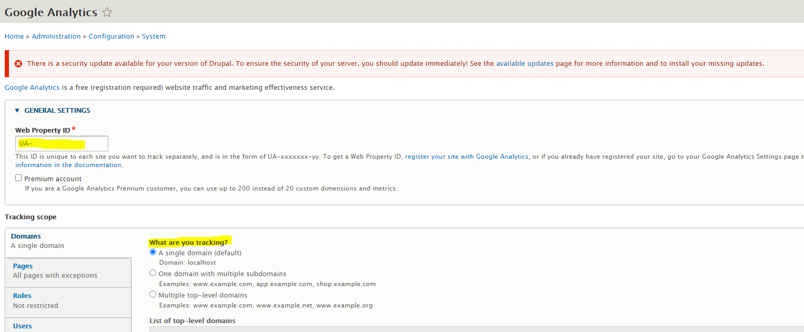


En bas de la page à gauche, cliquer sur 'Sauver la configuration'.

Dans admin/config/development/performance, il faudra nettoyer le chahe puis sauver.


### Intégration de GA sur Prestashop

Installer le module officiel: modules/modules et services => catalogue de modules => rechercher 'googleAnalytics" => installer

Il s'agit d'un module développé par Prestashop.

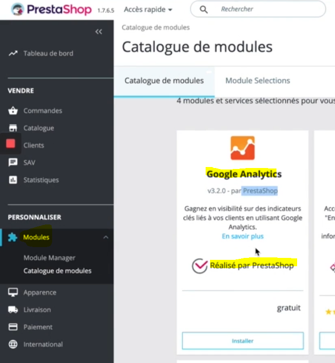

Ensuite: configurer

Se rendre dans GA et:

Dans le menu de gauche: Administration (icone engrenage)

Menu central: propriété => Informations de suivi => Code de suivi

Copier le code de suivi:


Et copier l'identifiant dans la case "ID de tracking Google Analytics".


Il est recommandé de sélectionner de **rendre les adresses IP anonymes** pour rester en règles avec la GDPR.

### Intégration de GA sur Shopify

Se rendre dans GA et:

Dans le menu de gauche: Administration (icone engrenage)

Menu central: propriété => Informations de suivi => Code de suivi

Copier le contenu de la partie encadrée:


Dans Shopify aller dans Boutique en ligne => Préférences.

Scroller jusqu'à 'Google Analytics' puis dans le champ 'Compte Google Analytics', copier le code provenant du site GA, puis cliquer sur enregistrer.


### Vérifier que GA est bien installé

Il est nécessaire d'utiliser un autre appareil pour se connecter au site que celui qui est utilisé pour consulter GA, par exemple un smartphone.

En effet,  GA va repérer que c'est la même machine utilisée et donc ne va pas comptabiliser la visite afin de ne pas prendre en compte les visites de la personne faisant l'audit du site web.

Si tout a bien fonctionné, l'on peut apercevoir notre connexion dans la rubrique temps réel / vue d'ensemble:


Si ce n'est pas le cas revoir les procédures d'intégration afin d'identifier ce qui n'a pas fonctionné.

Egalement il est utile de vérifier que toutes les pages du site qu'on veut auditer sont bien prises en compte.

## Lier GA à d'autres comptes

### Google Search Console

#### Créer un compte 

Par défaut GA mesure le trafic sur le site. La google search console va permettre de suivre le trafic en provenance du moteur de recherche Google.

Créer son compte: https://search.google.com/search-console

Pour des raisons de facilité, il est préférable que le compte Google utilisé pour l'inscription à ce service soit le même que celui pour l'inscription à GA. Dans le cas contraire il y aura une série de validations qui seront proposées pour lier les comptes.

Il est possible de créer une configuration pour tout un domaine.

Dans le cas du suivi d'un seul site, privilégier la seconde option, via préfixe de l'url. Il suffit d'introduite l'url du site à auditer. 

Ne pas oublier le 's' du 'https'. Car l'outil ne va pas convertir.


Si l'audit se fait sur le même site que celui de GA, la fenêtre suivante devrait apparaître.

Cliquer sur valider la propriété.

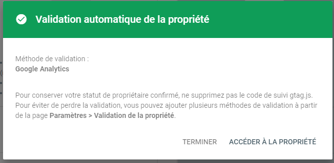

Si le site est différent, il sera proposé d'insérer à nouveau du code sur chaque page afin de vérifier que la personne souscrivant au service est bien le propriétaire du site (comme pour GA). Les deux services peuvent être utilisés indépendamment.

Au début il n'y aura aucune données et il faudra attendre quelques jours avant de les voir apparaitre.

#### Lier GA à Google Search Console

Le service ne sera pas lié automatiquement même s'il a été créé avec le même compte.

Il faut aller dans la partie administration (menu de gauche tout en bas), sélectionner 'tous les produits' et enfin 'search console'.

Cliquer sur 'Associer la Search Console'.

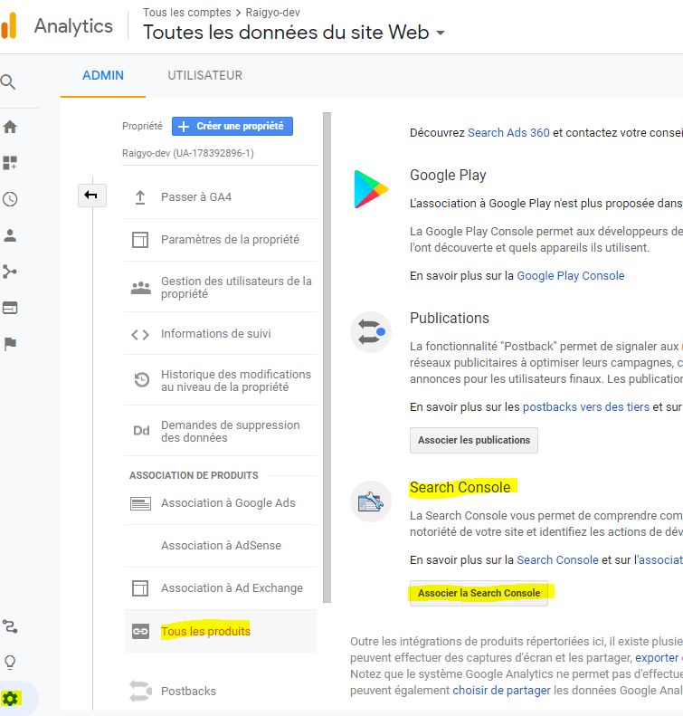


Puis cliquer sur 'Ajouter'.

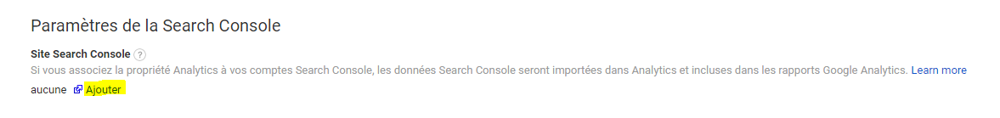

Ensuite sélectionner l'url du site à associer (il pourrait y en avoir plusieurs dans la search console).

Cliquer sur enregistrer et confirmer une nouvelle fois dans le fenêtre modale qui s'ouvre ensuite.


Pour vérifier, retourner dans Administration / Tous les produits.

Search console devrait apparaître en haut. Cliquer sur 'Paramétrer l'association'.

La vue devrait être activée.


Pour vérifier et faire le suivi, depuis le dashboard: Acquisition / Search Console / Pages de destination.


Au début il n'y aura aucune données et il faudra attendre quelques jours avant de les voir apparaitre.

### Google Ads

#### Lier GA à Google Ads

Aller dans Acquisition / Google Ads / Campagnes, puis 'associer vos comptes'.


Les compte Google Ads associés au même compte utilisateur seront listées. Sélectionner les Campagnes à auditer.

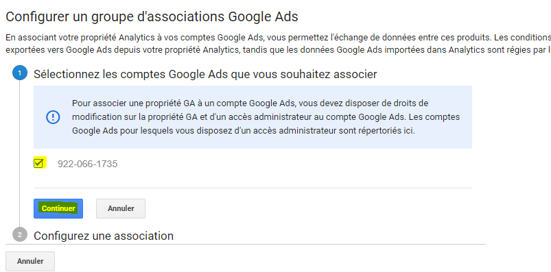

Créer un nom pour l'association, activer 'Toutes les données du site web'.

Puis 'Associer les comptes'. Cela prendra 24h avant d'être activé.


### Donner l'accès à d'autres utilisateurs

Permet de donner des accès au compte GA à un collaborateur, un associé, un client, un prestataire...

Il est possible de donner des accès à plusieurs niveaux: Compte, Propriété, Vue.

- Compte: accès à toutes les fonctionnalités, propriétés et vues.

- Propriété: accès à la gestion d'un site en particulier.
- Vue: permet de sélectionner juste une certaine partie des statistiques visible pour un utilisateur donné. On peut créer plusieurs type vues.

Dans administration.


Quel que soit le niveau choisi, c'est le même schéma.

On peut ajouter un ou plusieurs utilisateurs.


Ensuite, on peut affiner les droits.

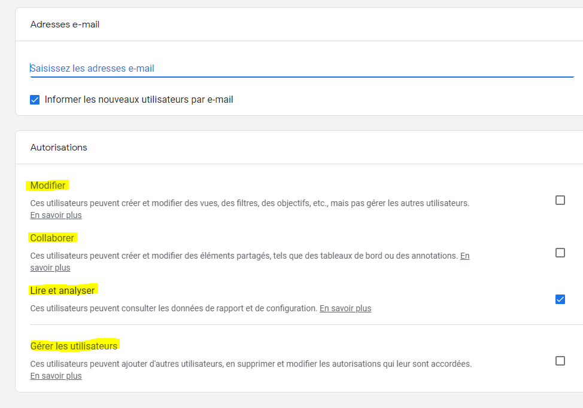

Lorsque l'on donne les droits à un utilisateur, ne pas oublier de supprimer cet utilisateur si celui-ci n'est pas plus habilité à accéder aux données (fin de contrat, départ de collaborateur...).


## Comment analyser les données?

### Quelles sont les types de données qu'il est possible d'analyser?

- L'audience: quel est le profil de nos visiteurs?
- Comparer les différents canaux d'acquisition de trafic
- Analyser le comportement pour améliorer l'expérience utilisateur

### Glossaire et définitions

**KPI (Key Performance Indicator)** : Pour savoir si votre site fonctionne bien, il est nécessaire de faire plus que simplement surveiller vos ventes. D’autres paramètres, appelés KPI (*fr*: indicateurs clés de performance), sont aussi importants quand il s’agit d’évaluer le succès ou la performance d'un site. Disons-le haut et fort : il est même impossible de déterminer le succès d’une page sans utiliser ces valeurs parfaitement mesurables.

Mais chaque paramètre doit-il être pris en compte de manière très détaillée ? Il n’y a pas de réponse universelle à cela. Les KPI à surveiller sont aussi dépendants de l’objectif de votre site. GA propose des KPI prédéfinis répartis en différentes catégories : temps réel, audience, acquisition, comportement et conversions.

**Engagement / taux d'engagement **: L'engagement en marketing dépend de plusieurs paramètres, il correspond à une notion qui désigne les prédispositions du consommateur à interagir avec un élément marketing ou une marque. Internet favorise grandement les interactions entre les consommateurs et les marques, on compte ainsi différentes formes d'engagements de la part des internautes. Le client potentiel peut s'engager suite à la réception d'un message publicitaire visuel, d'une newsletter, d'un e-mail, directement auprès de la marque ou via les réseaux sociaux par exemple. Les professionnels mesurent ensuite le taux d'engagement. On peut considérer qu'il existe plusieurs niveaux d'engagement : l'engagement simple, qui dénote un intérêt pour une marque, l'engagement pour l'achat, qui entraîne le consommateur à se renseigner davantage sur un produit spécifique et l'engagement viral qui concerne les consommateurs satisfaits, communiquant volontiers sur leurs marques favorites. L'engagement permet à la fois de fidéliser la clientèle, d'accroître la notoriété et d'échanger plus facilement avec les consommateurs.

**Session **: une session représente la visite d'un internaute (utilisateur) sur votre site web. La session englobe toutes l'activité que l'internaute effectue sur notre site et cette activité est limitée dans le temps. Après 30 minutes d'inactivité, la session prend fin. Si l'utilisateur reprend son activité après ces 30 minutes, cela sera considéré comme une seconde session. Un utilisateur peut donc avoir plusieurs sessions.

**Utilisateur **: un utilisateur est un internaute qui utilise notre site web. Ce dernier peut être assimilé à plusieurs sessions s'il a été inactif plus de 30 minutes. Un utilisateurs utilisant des appareils différents pour se connecter au site sera considéré comme plusieurs utilisateurs différents.

**Page vue** : une page vue représente le nombre de fouis qu'un visiteur a vu une page spécifique. Cela ne veut pas dire qu'il a vu toute la page ou qu'il l'a considérée avec intérêt, mais qu'elle a été générée dans le navigateur. Ainsi le nombre de pages vues représentera le nombre total de pages consultées sur notre site web. Si une même page est vue deux fois, cela sera considéré comme deux pages vues.

**Page par session** : une page par session représente le nombre moyen de pages vues au cours d'une même session. Ainsi, si  utilisateur visite notre site web et consulte plusieurs pages différentes, il s'agira du nombre de pages par session. Sur GA, on retrouve donc une moyenne des pages visitées par session, et ce, par tous les utilisateurs.

**Durée moyenne des sessions** : une session représente la période pendant laquelle un utilisateur est actif sur un site web. Ainsi la durée moyenne des sessions donne une idée du temps passé par session en moyenne sur notre site web. Permet de mesurer le taux d'engagement (engagement Rate).

**% de nouvelles sessions **: le pourcentage de nouvelles sessions représente le pourcentage des nouvelles visites sur notre site, des utilisateurs qui le consultent pour la première fois. De cette manière l'on peut déterminer si l'on attire des utilisateurs qui visitent notre site web pour la première fois ou, si à l'inverse l'on attire des utilisateurs qui ont déjà visité notre site et y reviennent.

**Taux de rebond** :  le taux de rebond représente le pourcentage de visites pendant lesquelles l'utilisateur a quitté le site web dès sa page d'arrivée, sans même interagir avec la page en question (bien que l'utilisateur ait peut-être lu toute la page). Ce n'est pas alarmant car il est normal qu'un utilisateur constate qu'il n'est pas sur un site qui correspond à sa recherche et s'en aille. Cependant si un taux de rebond est élevé, c'est préoccupant. Cela signifie que la page en question pourrait peut-être être améliorée ou encore, que la campagne qui a mené l'utilisateur sur cette page n'était pas assez claire.

**Canaux** : les canaux d'acquisition sont les sources du trafic de notre site (moteur de recherche, référencement naturel...). En les analysant, nous pouvons les regrouper par segments d'activités marketing: trafic provenant des réseaux sociaux, du SEO, emailing, campagnes publicitaires...

**Trafic organique** : le trafic organique est celui provenant des résultats naturels des moteurs de recherche comme Google, Bing, Yahoo... Ces résultats sont liés au référencement naturel SEO de notre site.

**SEO / Référencement nature**l :  SEO est l'acronyme de Search Engine Optimization et peut être défini comme l'art de positionner un site, une page web ou une application dans les premiers résultats naturels des moteurs de recherche. En français, le SEO est désigné par le terme de référencement naturel. Sur les requêtes visées, la position obtenue se doit essentiellement d'être en première page, car lors de la majeure partie des requêtes, c'est la seule page consultée. Désormais, il peut même s'agir d'obtenir la position zéro. La position zéro est un résultat de recherche positionné devant le premier résultat naturel sur Google. Elle est matérialisée par un bloc contenant les éléments d’une page web répondant à une question posée, on parle d’ « extrait optimisé ou featured snippet  ». La position zéro permet donc à Google de répondre directement à une question posée par un internaute, le plus souvent lors d’une recherche vocale effectuée sur Smartphone. Les termes position #0 ou ranking #0 désignent également une position zéro.

**Trafic référent** : le trafic référent est celui qui provient d'autres sites internet qui ne sont pas des réseaux sociaux (autres sites, blogs qui parlent de notre site et fournissent son lien).

**Trafic social** : le trafic social est celui provenant des réseaux sociaux (Facebook, Twitter, Instagram, linkedIn, Pinterest) et qui n'est pas associé à une publicité, c'est un trafic organique. Il peut cependant être organisé avec la collaboration d'influenceurs. Il permet de voir quel réseau social nous envoie le plus de visiteurs.

**Trafic payant / paid trafic** :  le trafic payé est celui obtenu via le réseau de recherche Google Ads, Bing Ads ou d'autres moteurs de recherche au moyen d'une campagne de coûts par clic (CPC). Cela inclus également les campagnes marketing publicitaires payantes sur les réseaux sociaux.

**Trafic direct** : le trafic direct est celui de toutes les sessions qui proviennent d'un utilisateur qui a saisi l'adresse de notre site directement dans la barre de recherche de son navigateur ou qui l'a placé dans sa sections 'favoris'. Il s'agit souvent d'internautes récurrents qui connaissent bien notre site.

**Événements** : les événements représentent les interactions d'un utilisateur avec un contenu. Il existe plusieurs types d'actions ou d'interactions que l'on peut suivre tels que les téléchargements, les lectures vidéo, les clics sur une annonce, remplir un formulaire, etc.

**Conversion** :  une conversion représente une action réalisée en ligne ou hors ligne et qui est primordiale pour atteindre les objectifs de l'entreprise. il s'agit par exemple d'un achat dans la boutique, une demande de formulaire de devis... Mais cela peut être plus pointu, comme fidéliser le visiteur à un service en démonstration de façon récurrente et prolongée.

**Taux de conversion** : pourcentage de visiteurs ayant fait une conversion. Le taux de conversion sur GA est intimement lié aux objectifs de conversion. En effet, ce taux permet de connaître le pourcentage de visites ayant abouti à une conversion et ce, en lien avec un objectif configuré.

**Entonnoir de conversion / conversion funnel** : correspond au parcours entrepris par un prospect sur vos réseaux digitaux, et le menant à un objectif précis, défini par vos soins.

**RGPD / GDPR** : La nouvelle législation européenne RGPD a pour vocation de mieux protéger la vie privée et la confidentialité des citoyens. RGPD signifie Règlement général sur la protection des données et en anglais GDPR pour European General Data Protection Regulation.

Le but est de renforcer la protection de la vie privée du citoyen en édictant des règles uniformes à l'échelle de l'Union européenne : 

- le citoyen dispose d'un meilleur contrôle sur l'utilisation de ses données personnelles
- le RGPD instaure un cadre légal clair, afin que les entreprises sachent comment s'y prendre pour garantir la confidentialité

Toutes les organisations, les entreprises et les instances publiques qui collectent et traitent les données personnelles de citoyens européens doivent appliquer le RGPD, quel que soit leur pays d'implantation.

### Comment analyser les données en fonction d'une période donnée?

Lorsqu'on analyse nos données, c'est pour une plage de dates. Il y a toujours une date de début d'analyse et une date d'analyse.


Par défaut GA nous affiche la dernière semaine, ml est possible de définir sa propre plage de dates.

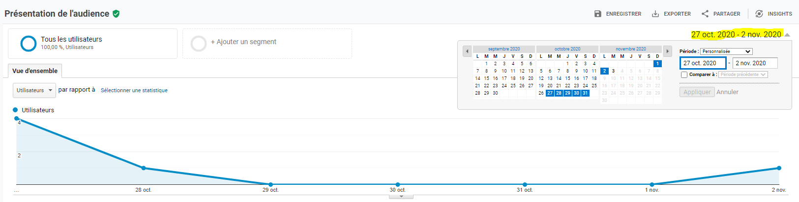

L'on peu ensuite affinner en affichant le graphe par heures / jours / semaines / ou mois.

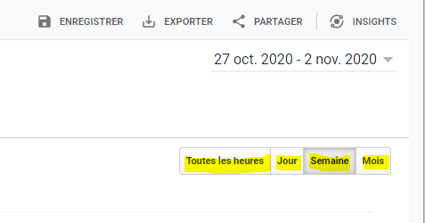


## Analyser l'audience et acquérir de nouveaux clients

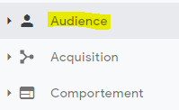


### La vue d'ensemble de notre audience

C'est le rapport par défaut de l'audience reçue par rapport à une plage donnée.

Sur le graphe on peut voir précisément le nombre de visiteurs pour un jour donné.

Le graphe en camembert à droite montre la proportion de nouveau visiteurs et la proportion de visiteurs qui reviennent.

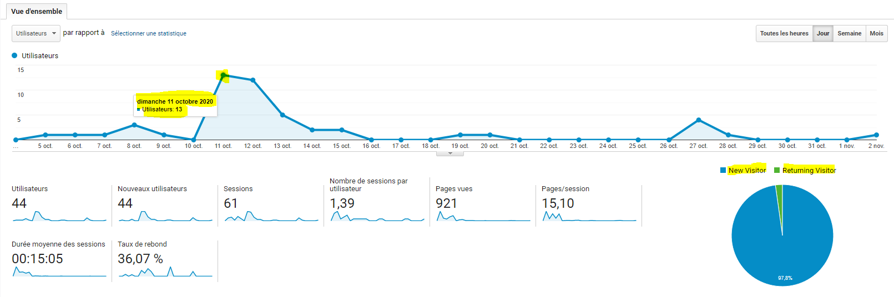

En dessous du graphe se trouvent des données chiffrées. Un rappel des notions s'affiche en info-bulle lorsque l'on passe la souris sur les intitulés.


D'autres données sont aussi disponible dans la vue d'ensemble, comme les données démographiques, des informations sur le système utilisé par le visiteur et des informations relative au mobile s'il utilise ce type de système.

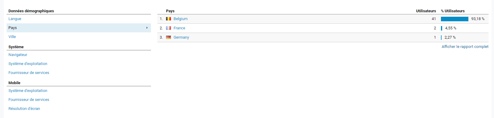

### Analyser les données démographiques

L'onglet avec les données démographiques permet accéder aux données d'âge et de sexe des visiteurs.

Il faut l'activer. A noter qu'il est important de mettre à jour les conditions d'utilisation du site audité et informer les utilisateurs selon les règles en vigueur, notamment la **GDPR**.

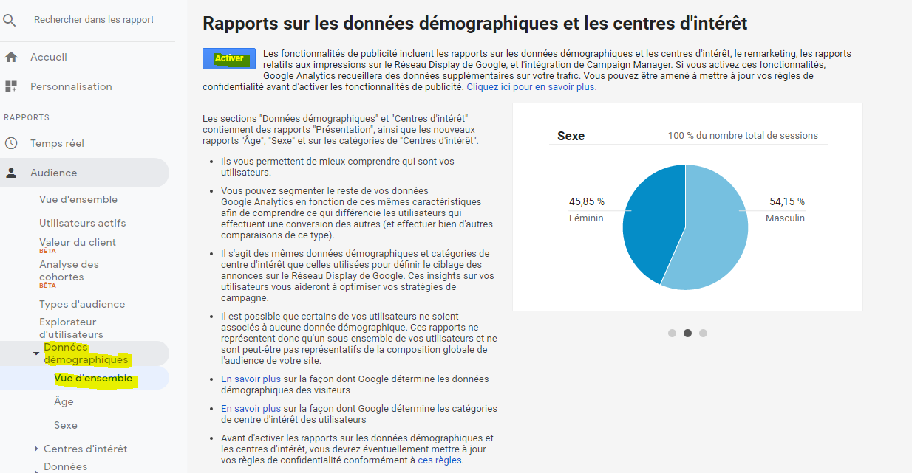


#### Age et sexe

Cela permet de voir le public qui visite le site correspond bien au public ciblé.

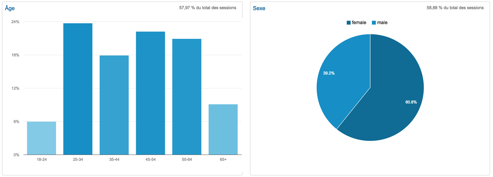

### Analyser les données géographiques

L'on peut recueillir les données linguistiques et la zone géographique des visiteurs.

#### Données linguistiques

Les données linguistiques correspondent à la langue d'installation du système d'exploitation du visiteur.

Les données ne sont donc pas toujours représentatives car un visiteur peut être par exemple francone mais utiliser un système dans une autre langue (expatrié, depuis une société internationnale où tous les systèmes d'exploitations sont en anglais).

Egalement ces données peuvent attirer l'attention sur certaines annomalies, par exemple de nombreuses visites dans une langues qui ne correspond pas du tout à celle du site, il peut s'agir de bots, des logiciels opérant de manière autonomes et automatiques pa avec de mauvaises intentions (vols de données).  

Les données linguistiques doivent donc être recoupées avec les données de la zone géographique.

Concernant les codes ISO, il s'agit de la langue puis du pays, par exemple:

- fr-fr: français de France
- fr-be: français de Belgique

- en-gb: anglais du Royaume-Uni
- en-us: anglais des USA

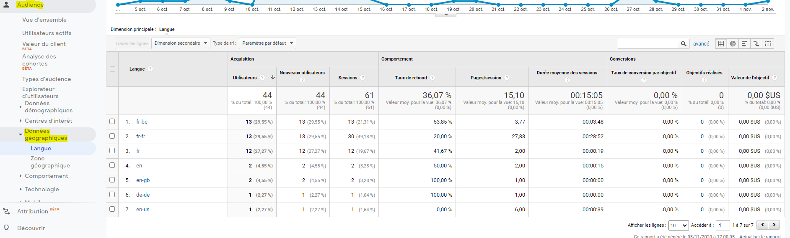

#### Données de la zone géographique

Les données de la zone géographique permettent d'afficher la provenance des visiteurs.

Il est possible de sélectionner une dimension principale: pays, ville, continent ou sous-continent.

Il peut être important de vérifier l'origine des visiteurs car dans certains cas cela peut influencer leur comportement.

Par exemple un site de vente en ligne français qui ne vend pas en dehors de la France, il faudra prendre en compte les visteurs d'autres pays dans l'analyse des taux de conversion, de rebonds...

L'on peu affiner avec d'autres critères faisant partie de la dimension secondaire permettant d'ajouter des filtres.

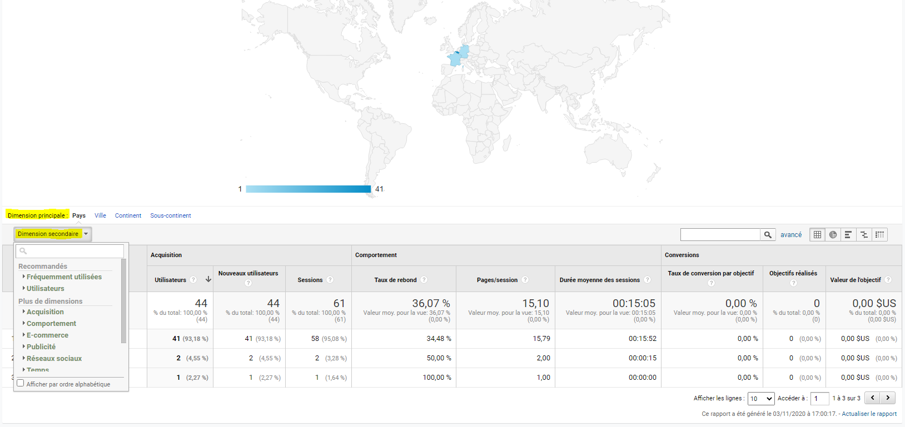

Exemple de données affichées par ville et si oui ou non, la visite provient d'un appareil mobile.

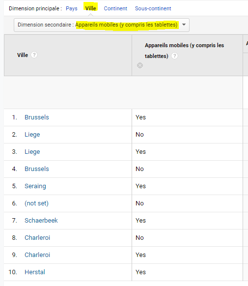

### Engagement des visiteurs

#### Visiteurs nouveaux / connus

L'étude des comportements permet de visualiser les visiteurs qui sont nouveaux sur le site et ceux qui sont déjà venus.

Dans les sites d'e-commerce il est important d'avoir un nombre élevé de 'returning visitors'. dans le cas de la générations de 'leads' c'est l'inverse, il est bon d'avoir beaucoup de nouveaux venus.

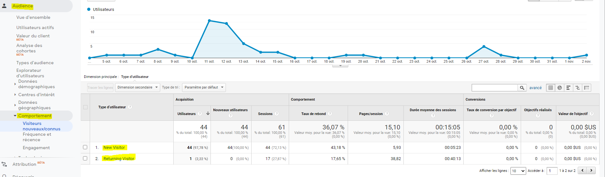

#### Fréquence et récence 

La section fréquence et récence permet de voir le nombre de sessions faites par des utilisateurs et leur récurrence ainsi que le nombre de pages totales visitées (les visites répétées d'un internaute sur une même page sont prises en compte).

Dans l'exemple suivant, 44 utilisateurs n'ont fait qu'une seule session (visite).

Mais 5 utilisateurs ont fait entre 9 et 14 sessions.

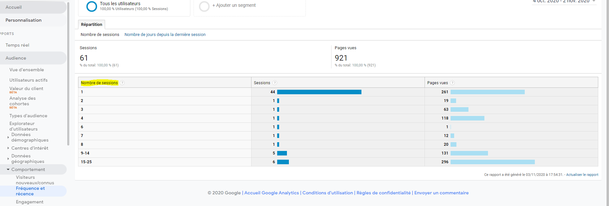

#### Engagement

##### Segment de durée de la session

L'engagement via 'Segment de durée de la session' permet de voir la durée des différentes sessions et le nombre total de pages vues en fonction des durées.

Dans l'exemple suivant, 23 sessions ont duré 0 à 10 secondes pour un total de 24 pages vues.

Mais, 9 session ont duré plus de 1801 secondes pour un total de 702 pages vues.

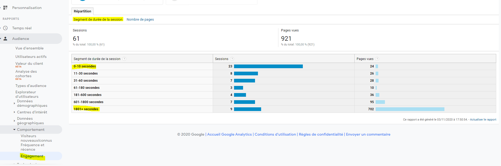

##### Nombre de pages

Il s'agit du nombre de pages vues en fonction des sessions.

Dans l'exemple suivant, 22 visiteurs n'ont vu qu'une seule page (pour un total de 22 pages vues en toute logique).

Mais, 9 visiteurs ont vu plus de 20 pages, pour un total de pages vues égal à 709.

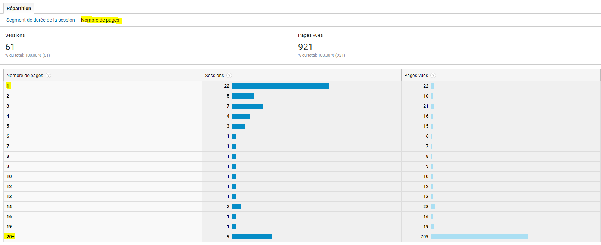

A noter que si la première entrée indique "<1", il s'agit des visiteurs ayant quitté le site avant qu'il soit chargé (parce qu'ils se rendent compte qu'ils se sont trompés, parce que le site est trop lent à charger...). Si le nombre est anormalement élevé il faut en rechercher la cause (par exemple est-ce que le site ne connait pas un problème avec son serveur d'hébergement).

### Technologie utilisée par les visiteurs

#### Navigateurs et OS

Permet de voir quels systèmes les visiteurs utilisent et d'afficher des données techniques: navigateur, système d'exploitation, résolution d'écran, couleurs d'écran...

Ces données sont très importantes pour les développeurs des sites car cela permet de connaître les configurations les plus utilisées et d'adapter leur technologies et leur test pour s'assurer que tout fonctionnera correct dans ces configurations.

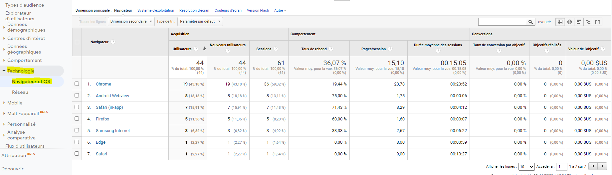

#### Réseau

Affichait à l'origine les nom du provider du visiteur, voire le nom de l'entreprise d'où provenait la connexion.

Cela est désactivé (not-set), pour rester en concordance avec la GDPR.

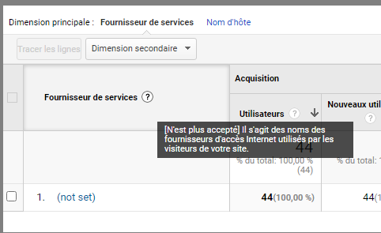

### Appareils utilisés par nos visiteurs

Cela permet de voir depuis quel type d'appareil l'utilisateur provient.

L'on peut ajouter d'autres filtres via la dimension secondaires.

Il est normal de constater un déclin des tablettes qui ont fait place aux smartphones de grande taille.

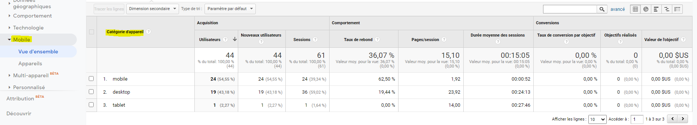

La vue détaillées (Appareils) permet d'avoir des informations sur les marques et les modèles d'appareils utilisés, mais aussi le système d'exploitation...

Le fournisseur de service est désactivé (not-set), pour rester en concordance avec la GDPR.

Ces données sont très utiles pour les développeurs également car cela permet de mieux cibler les développements.

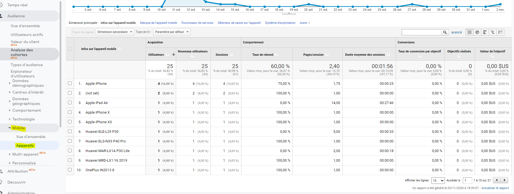


## Comparer les différents canaux d'acquisition de trafic

### Vue d'ensemble des canaux d'acquisition

Comment arrive notre audience sur notre site?

Les principaux canaux sont listés sur le camembert:

- Organic search: les moteurs de recherche
- Direct: via favoris ou en tapant l'url directement
- Referal: ce qui vient d'un autre site via un lien (sponsorisé ou non)
- Social: via les réseaux sociaux
- Email: via des emailing avec trackers (campagnes)

Il est conseillé d'équilibrer les canaux d'acquisition. En effet un site qui par exemple ne tablerait que sur la recherche organique et qui pour certaines raisons se verrait désindexé perdrait dès lors tout son trafic.

Il faut donc tâcher de ne pas dépasser les 50% pour la recherche organique et investir dans différents canaux.


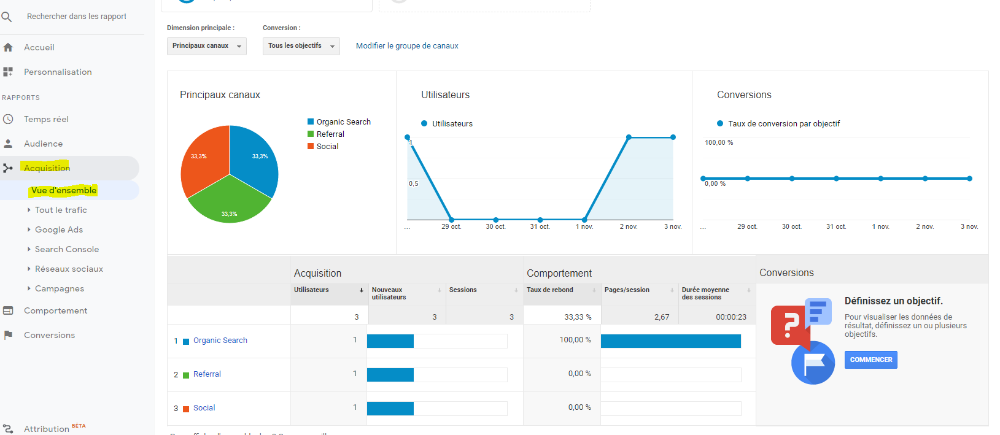

### Impact des réseaux sociaux sur notre trafic

Dans la sections "Canaux" sont affichés les canaux d'acquisition par types:


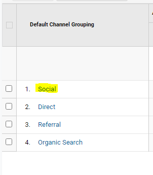

A noter que GA n'affichera que les canaux qui ont été utilisés lors de la période sélectionnée.

On peut voir par exemple dans "Social" les différents médias sociaux et évaluer l'impact et l'efficacité des différentes campagnes organisées sur ceux-ci.


### Où en est notre optimisation de notre référencement naturel (SEO)?

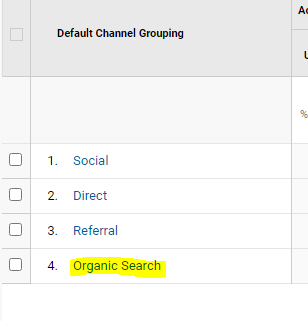

Dans cette vue on peut voir la liste des différents moteurs de recherche utilisés.

Google étant le plus utilisé, il est important de la voir apparaître en premier, sinon cela veut dire que le site n'a pas été optimisé au niveau SEO.

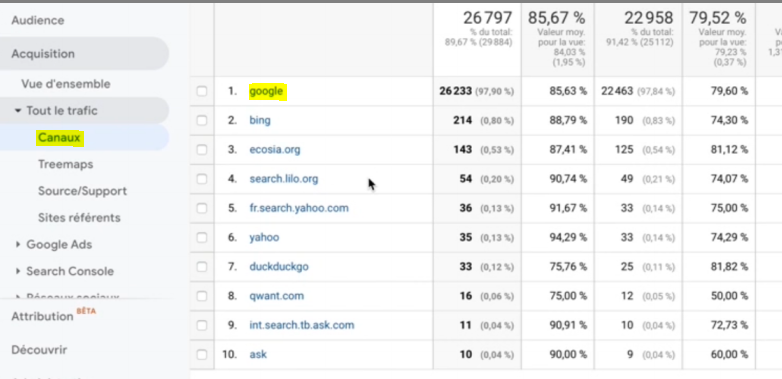

Pour avoir des données plus poussées, il faudra se rendre dans la "Search console".

On pourra y trouver les nombre de fois où le site a été affiché dans google suite à certaines requêtes.

- Clicks: le nombre de clicks vers le site suite à une recherche

- Impressions: le nombre de fois que le site est apparu dans Google suite à une recherche (mais sans qu'il y ait nécessairement de click)
- CRT: Taux de clics = Clics/Impressions * 100.
- Position moyenne: Il s'agit du classement moyen des URL du site pour les requêtes. 

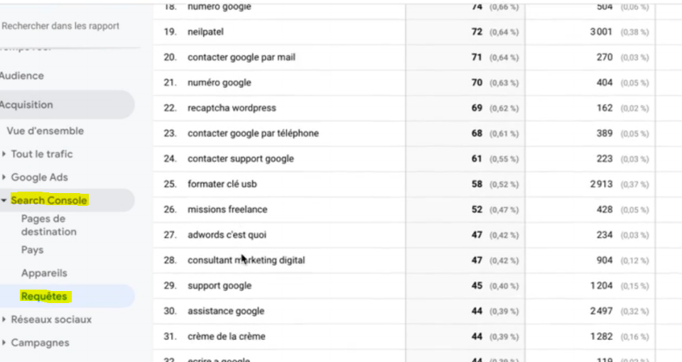

On peut avoir aussi le détail par pages du site dans la rubrique "Pages de destination".

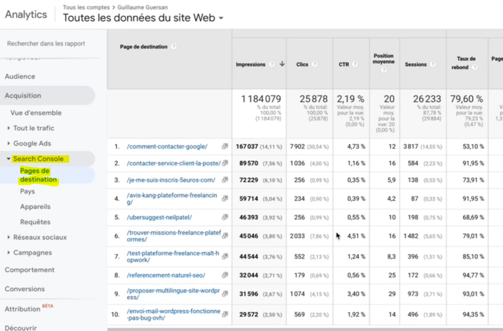


### Quels sites nous amènent du trafic?

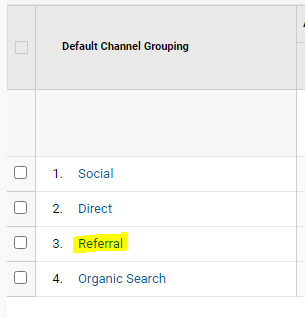

Cela permet de voir quels sont les sites qui proposent un lien vers notre site.

Cela peut être utile pour créer des campagnes et des partenariats avec les sites qui ont des visiteurs qui pourraient également être intéressés par nos services.

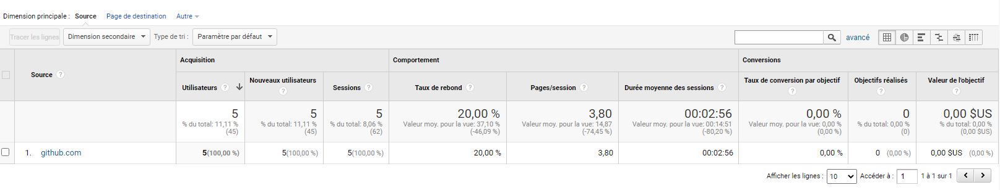

### Liens directs

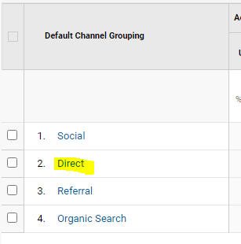

Il s'agit des utilisateurs qui ont directement tapé l'url dans la barre de recherche ou qui ont mis le site en favoris.

Ces données sont plus difficiles à analyser et il faut les recouper avec d'autres informations. Par exemple pour un site de commerce en ligne, peut-être que les visiteurs sont des habituées et on l'adresse du site en favori.

### Analyser l'impact des campagnes publicitaires avec Google Ads

Permet de vérifier l'efficacité des campagnes Google Ads et d'ajuster sa stratégie en fonction de sa rentabilité en terme d'acquisitions.


## Analyser le comportement pour améliorer l'expérience utilisateur

### Contenu du site : quelles sont les pages les plus populaires

Il est possible ans la rubrique "comportement" d'afficher des statistiques pour les pages les plus populaires du site.

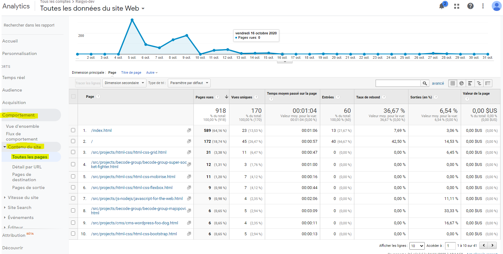


Les pages de destinations sont les pages sur lesquelles les visiteurs arrivent.

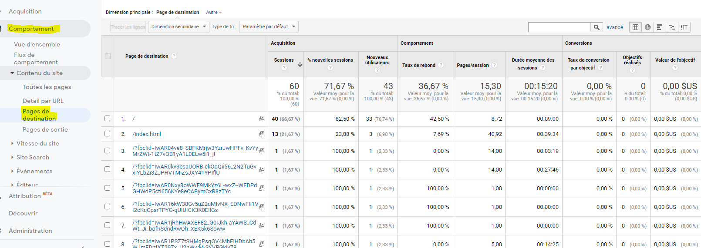

Et les pages de sortie les pages depuis lesquelles les utilisateurs ont quitté le site.

Cela peut être un indicateur des pages dont le contenu devrait peut-être être amélioré.

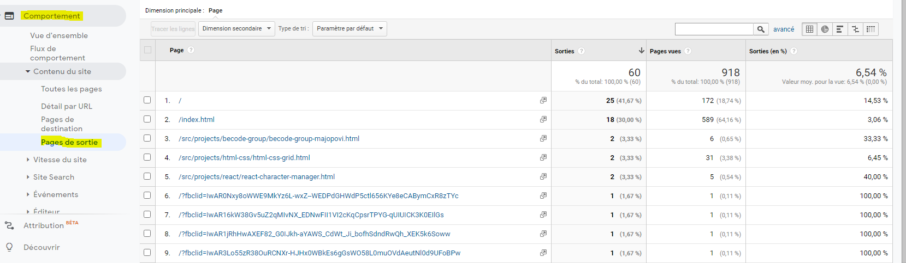

### Vitesse du site : comprendre quelles sont les pages lentes de notre site

**Il est très important de veiller à la rapidité d'affichage d'un site et de toutes ses pages car c'est très important pour le taux de conversion et pour le SEO.**

Ce rapport ne prend en compte qu'1% du trafic ce qui peu expliquer des chutes dans le rapport ou l'absence de données.

Il est possible de modifier ce pourcentage en modifiant le code sur les pages HTML.

```
// Avec gtag.js, comme montré dans le chapitre sur l'intégration
gtag('config', 'UA-XXXXX-Y', {'siteSpeedSampleRate':100}); // 100% samplerate

// Avec analytics.js
ga('create', 'UA-XXXX-Y', {'siteSpeedSampleRate': 100}); // 100% samplerate

```

Egalement il s'agit d'un calcul fait sur base d'un échantillon de pages vues.

Le temps de chargement indique le chargement total de la page. Dans les faits l'utilisateur peut donc avoir déjà accès au contenu avant.

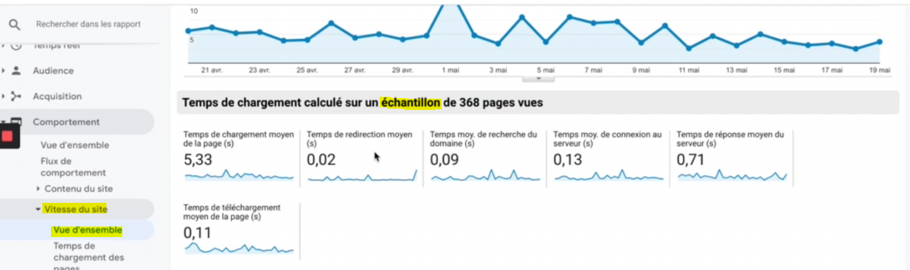

Il y a un classement par navigateur, ce qui peut donner des indications aux développeurs sur ce qu'il y aurait lieu d'optimiser.

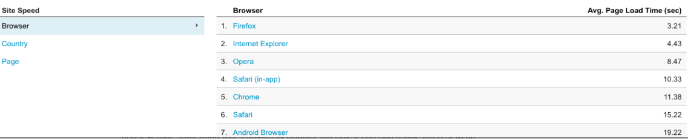

Dans la rubrique "temps de chargement des pages", on peut avoir accès aux données pour chaque page du site. Cela permet de repérer les pages qui seraient plus lentes au chargement.

NB: un slash (/) tout seul représente la page index / "splash page".

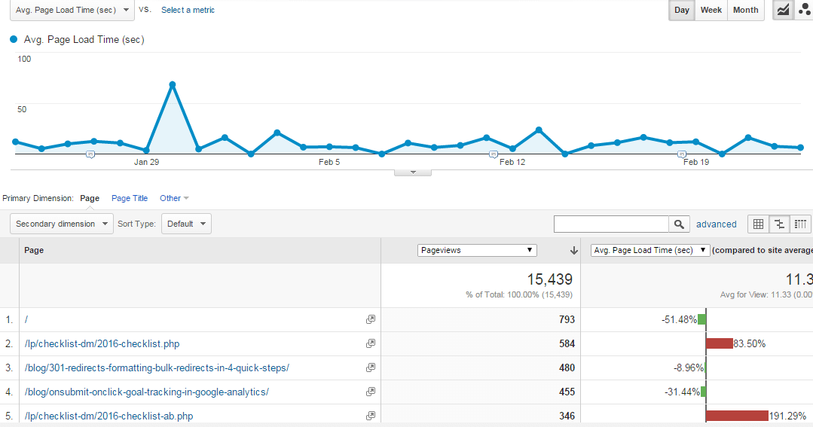

La rubrique 'suggestions relatives à la vitesse' permet d'afficher la liste des pages les plus lentes et propose des pistes de solutions lorsqu'on clique sur les liens via une analyse via un autre outil externe de Google : [PageSpeed Insights](https://developers.google.com/speed/pagespeed/insights/?hl=fr).

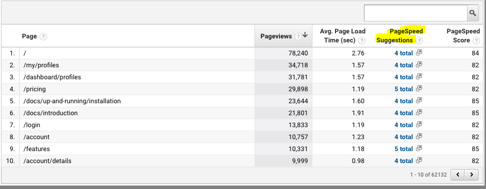

Pour la rubrique 'temps utilisateur', si elle est vide cela peut être dû au fait qu'il n'y a pas assez de visites.

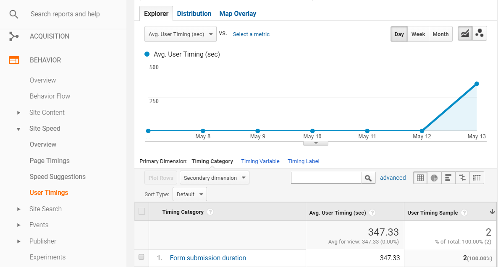

L'on peut cependant modifier le script inséré au début de chaque page pour avoir des données plus représentatives.

```
// Avec gtag.js, comme montré dans le chapitre sur l'intégration
gtag('event', 'timing_complete', {
  'name' : 'load',
  'value' : 3549,
  'event_category' : 'JS Dependencies'
});

// Avec analytics.js
ga('send', {
  hitType: 'timing',
  timingCategory: 'JS Dependencies',
  timingVar: 'load',
  timingValue: 3549
});
```

**Pour les développeurs** : pour des données plus précises et plus adaptées à l'optimisation des pages - notamment la vitesse de chargement, les développeurs utiliseront des outils comme [Lighthouse](https://developers.google.com/web/tools/lighthouse) (extension du navigateur) ou accéderont directement à [PageSpeed Insights](https://developers.google.com/speed/pagespeed/insights/?hl=fr) afin d'optimiser les pages du site lors du développement.

### Site Search : trouver des opportunités avec notre moteur de recherche interne

Cette rubrique concerne les sites ayant un **moteur de recherche interne**. Cette fonctionnalité est indispensable sur les sites de commerce en ligne par exemple.

L'on peut voir le nombre de visites ayant occasionné une recherche, le nombre de recherches uniques...

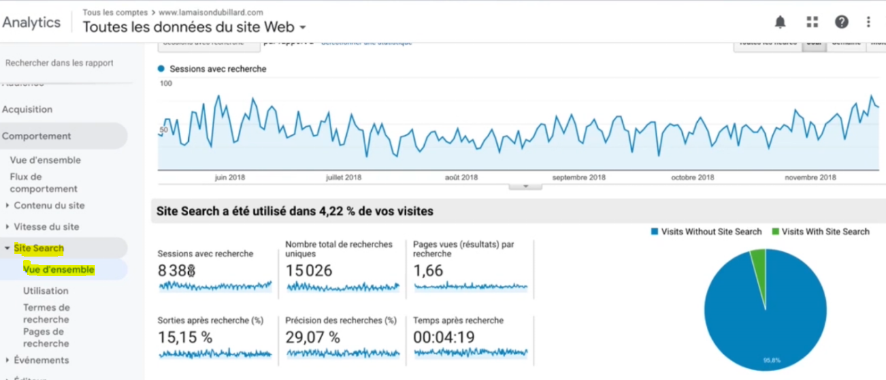

Dans la partie "utilisation", on aura une vue d'ensemble des visites ayant occasionné une recherche.

S'il y a peu de recherches effectuées sur le site, peut-être est-ce parce que la barre de recherche est mal placée, peu ergonomique...

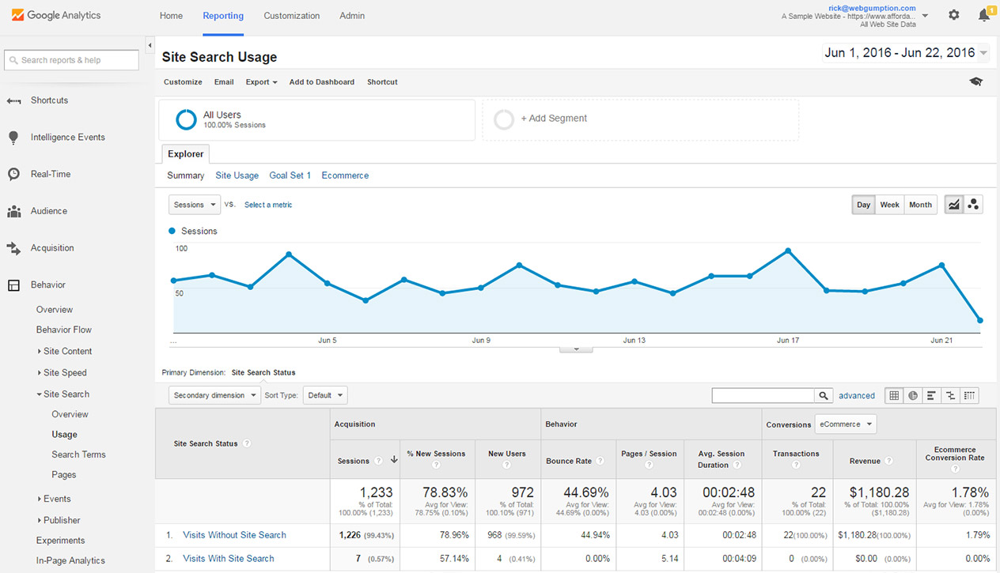

Dans la partie "termes de recherche", l'on aura une liste des termes utilisés par les utilisateurs dans notre moteur de recherches.

Très utile par exemple dans le cadre d'une boutique en ligne pour commander des produits que l'on n'aurait pas en catalogue mais qui seraient recherchés par les visiteurs. Cela peut aussi donner des idées d'ajout de contenu, par exemple sur un site institutionnel, de services ou une encyclopédie en ligne, s'il n'y a pas de rubrique correspondant aux questions / recherches des utilisateurs.

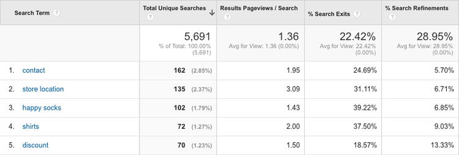

### Évènements : analyser les actions de nos visiteurs

Dans cette rubrique l'on peut faire un suivi de tous les événements que l'on a créés, par exemple : ajout d'un produits dans le panier, remplir un formulaire, télécharger un document...

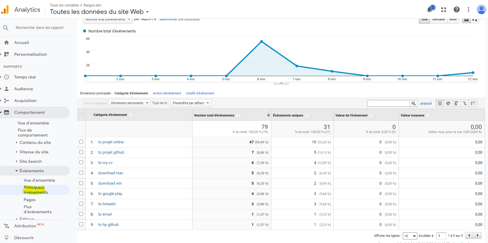


L'entrée "pages" permet de voir depuis quelles pages ont été générés les événements.

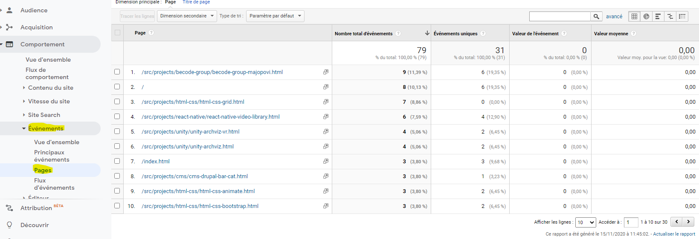


"Flux d'événements" permet de voir en un coup d'oeil l'intérêt des internautes pour les éléments interactifs du site.


### Flux de comportement : analyser le parcours de nos visiteurs

Il s'agit, toujours pour une période donnée, d'une représentation graphique du parcours des visiteurs sur notre site.

Cela permet de comprendre comment ils sont arrivés sur notre site, comment ils voyagent dessus et avoir une vue instantanée du taux de rebond.


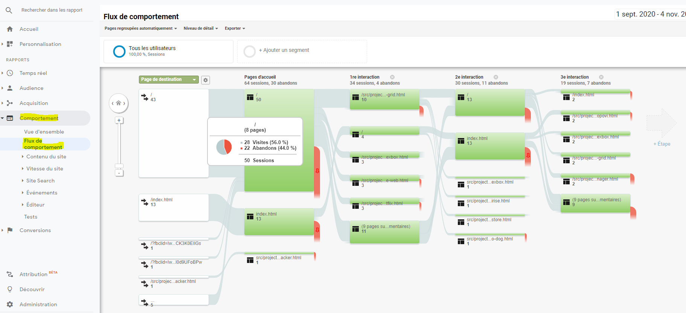

## Tableau de bord et rapports email

### Créer un tableau de bord

Plutôt que d'avoir le tableau de bord par défaut, il est possible de personnaliser son propre tableau de bord avec les données souhaitées.

Il est même possible de créer plusieurs tableaux de bords.


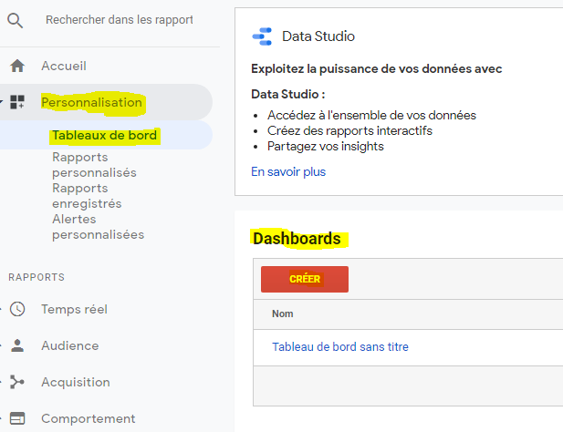


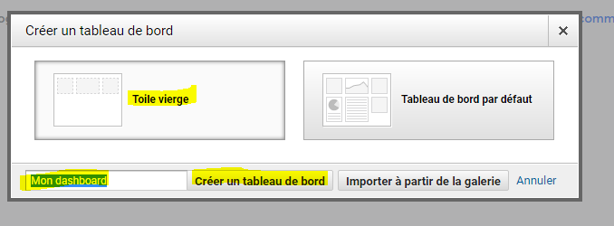


On va ensuite pouvoir ajouter des widgets.

Pour les statistiques :

- Statistiques : données chiffrées
- Chronologie : graphiques sur un laps de temps donné
- Geo Map : données géographiques
- Tableaux
- Diagrammes (camemberts)
- Barres

Pour les données en temps réel (utile pour les très gros sites) 

- Compteur
- Ligne du temps
- Geo Map : données géographiques
- Tableaux

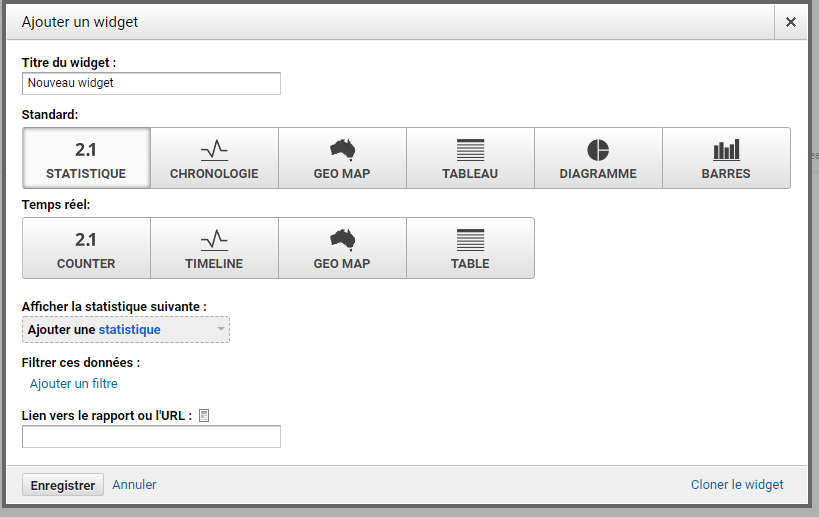

On peut pour chaque widget, définir quelle statistique l'on veut afficher ainsi que lui affecter des filtres.

Par exemple pour ajouter une widget avec les sessions :


Puis enregistrer et cela donnera une nouvelle carte sur le tableau de bord personnalisé :

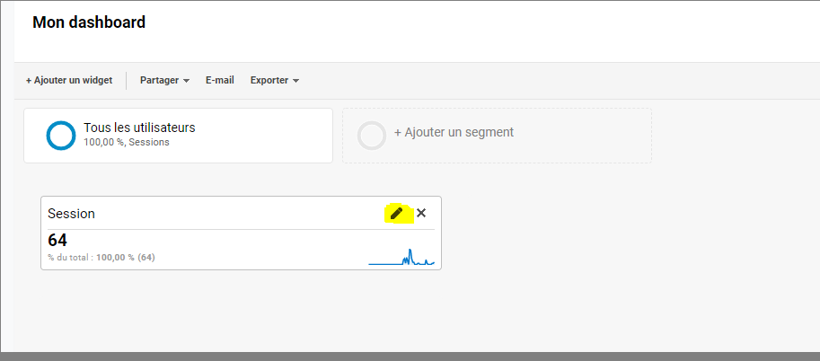

Il est possible de modifier le widget en cliquant sur le petit crayon en haut à droite de la carte.

Autres exemple avec l'ajout d'une chronologie :

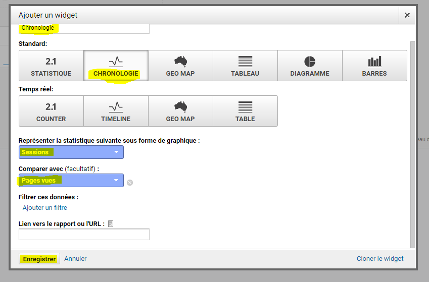


Ce qui donnera :

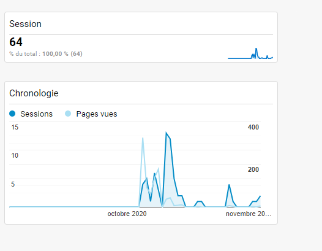

Exemple pour afficher les pages les plus populaires :

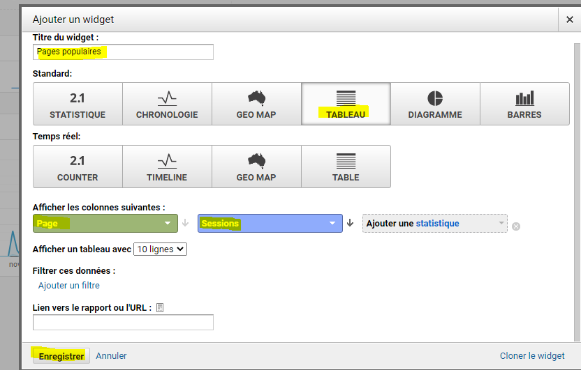


Un dernier exemple pour ajouter la durée des visites :


Résultat avec les quatre widgets ajoutés :

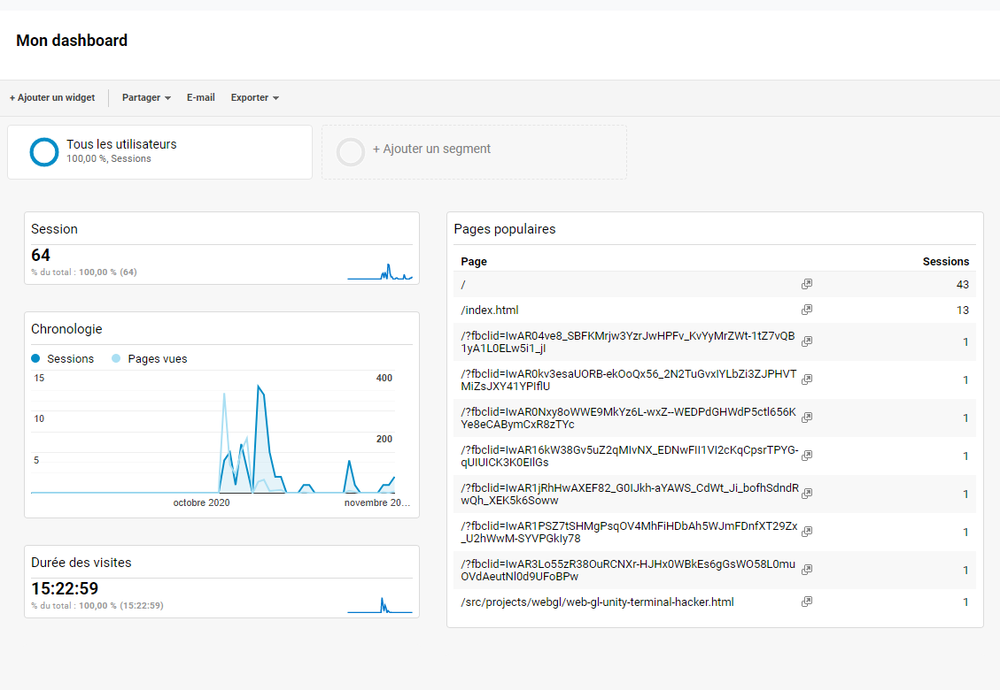


Il est possible de déplacer les cartes sur le dashboard en cliquant au dessus de celle-ci (lorsque le curseur se transforme en croix de déplacement).

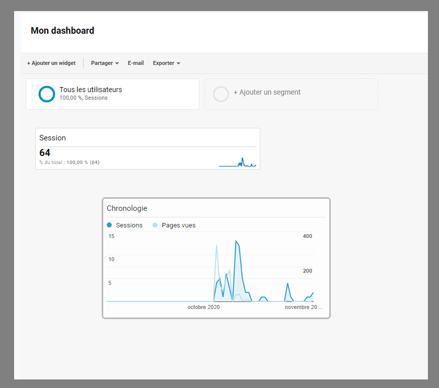

L'on peut aussi choisir une disposition préconfigurée en sélectionnant "Personnaliser le tableau de bord".

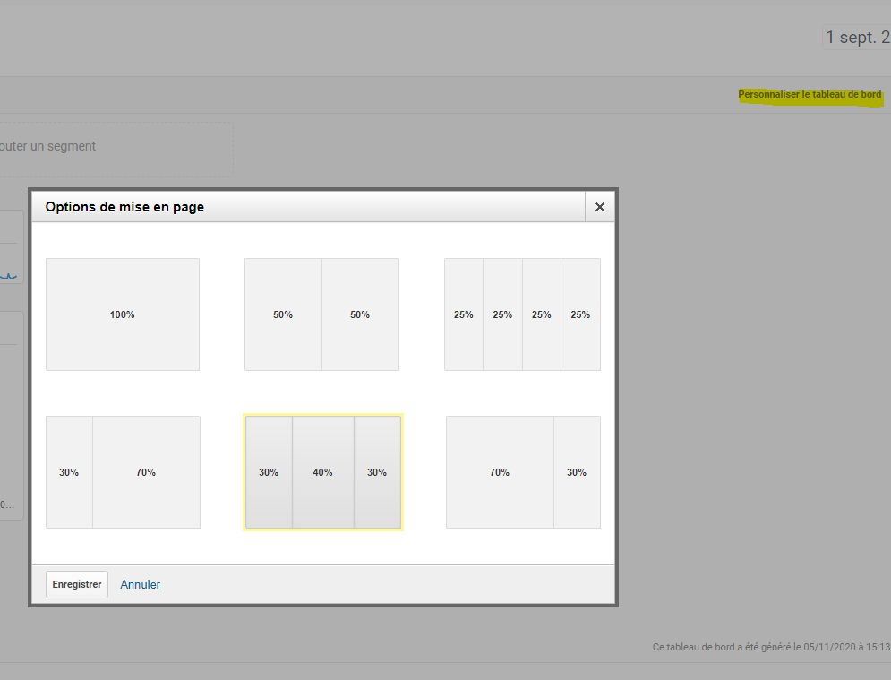

### Comparer les données entre deux périodes

Par défaut les vues affichent une période donnée.

Mais il est possible de comparer deux périodes et ce dans toutes les vues. Il suffit de cocher "Comparer à" dans le sélecteur de dates.

Cela permet de comparer les données en fonction des mois, de certaines périodes et entrer dans une analyse approfondie.


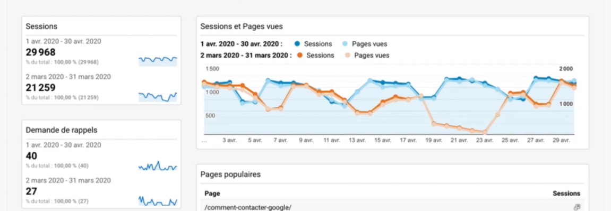


### Envoyer des rapports par email

Il est possible d'**enregistrer** les rapports dans l'interface en leur donnant un nom :

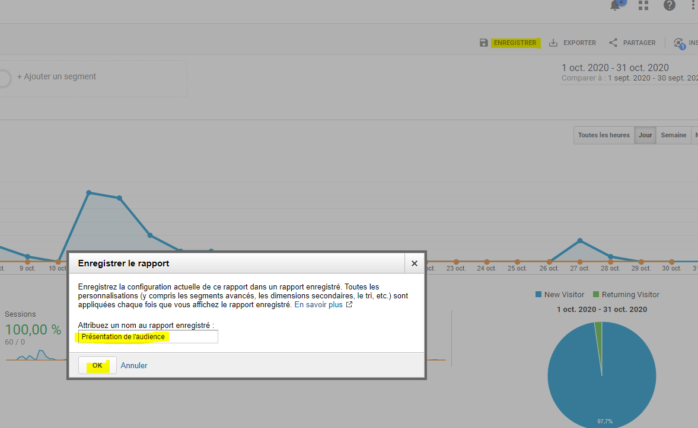

Pour les retrouver :

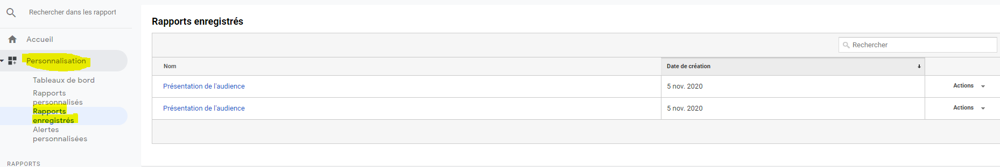

Les rapports peuvent être **exportés** dans différents formats :

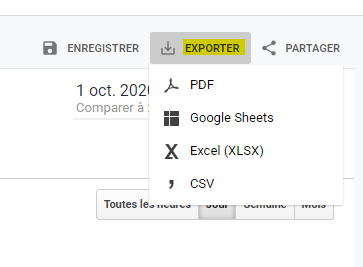

Ou partagés par email : 

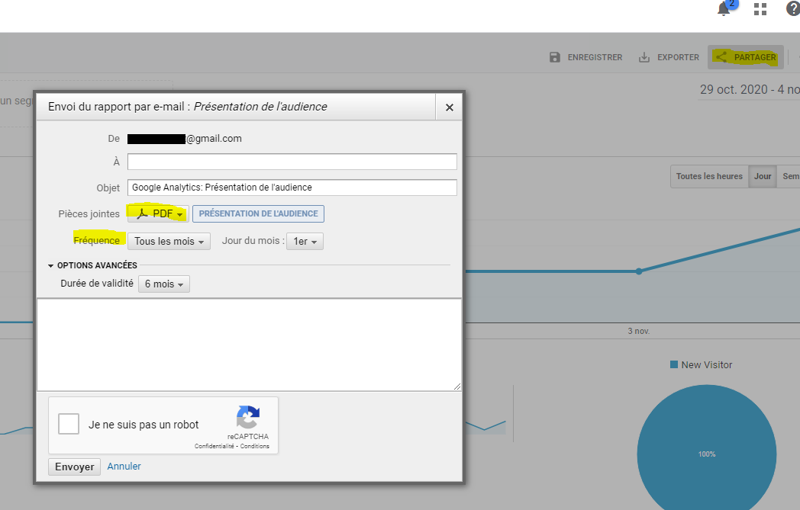

On peut choisir la fréquence d'envoi automatique, le jour de l'envoi, le format (pdf, excel)...

On peut programmer l'envoi depuis n'importe quelle vue, y compris depuis le tableau de bord personnalisé, ce qui permet d'envoyer des données qui ont été sélectionnées pour leur représentativité, aux collègues, management, clients...

## Suivi d'événements, objectifs et taux de conversion

### La notion d'événement

Les événements sont toutes les actions de l'utilisateur pouvant être trackés.

Un code pour tracker un événement requiert une série de données : 

- Catégorie (obligatoire) est le nom que vous donnez à un groupe d'objets que vous souhaitez suivre.
- Action (obligatoire) est le type d'interaction, comme le téléchargement d'un document, un formulaire complété...
- L'étiquette (facultative) est utile pour résumer l'objet de l'événement, comme les clics sur les options du menu de navigation. il est plus que conseillé de l'utiliser pour mieux s'y retrouver.
- La valeur (facultative) peut être utilisée si vous souhaitez attribuer une valeur numérique à votre téléchargement de fichier.

Exemple à insérer dans le code html :

````
<a href="lien de mon fichier" onclick="gtag('event', 'action de mon événement', {'event_category': 'catégorie de mon événement', 'event_label': 'label de mon événement'});">ancre de mon lien</a>
````

En pratique (exemple) :

````
<a href="https://guersanguillaume.com/wp-content/uploads/2018/04/SEMrush-Certification-for-Social-Media-Marketers.pdf" onclick="gtag('event', 'clic', {'event_category': 'telechargement', 'event_label': 'tarifs2020'});">tarifs</a>
````

Pour les CMS (Prestashop, Wordpress...) il existe des extensions permettant d'effectuer le suivi.


### Vérifier qu'un événement est bien suivi

Pour vérifier qu'un événement est bien pris en compte, aller dans "temps réel" / "événements".

On peut y voir les actions et leurs libellés.  s'assurer que tous les trackings d'événements fonctionnent, il faut les tester manuellement.

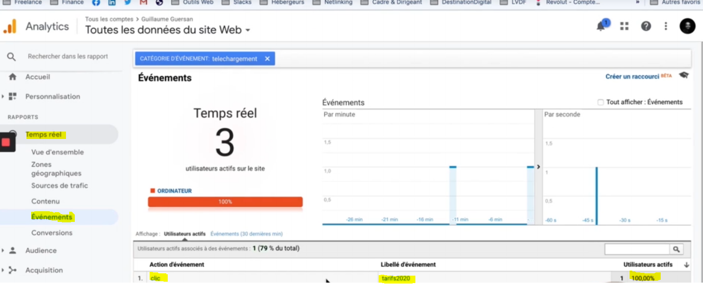


### Paramétrer des objectifs pour suivre son taux de conversion

Les événements crées vont servir à configurer des objectifs qui permettront de calculer le taux de conversion de notre site.

Il faut aller dans administration / objectifs.

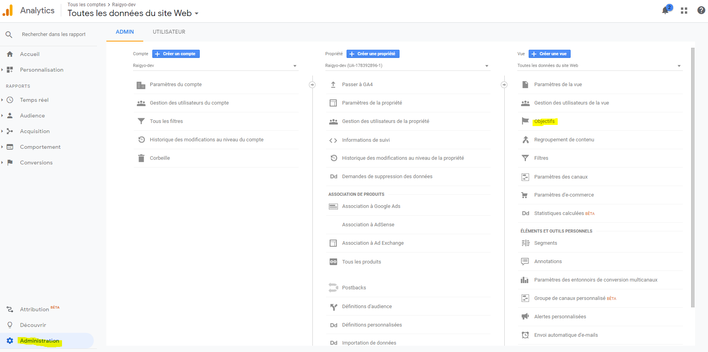

Puis "Nouvel objectif" :

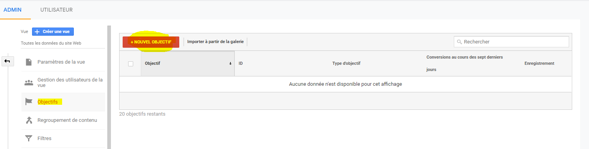


On peut choisir un modèle car par exemple on peut avoir pour objectif qu'une page déterminée du site ait été vue.

Pour des objectifs de tracking il faut choisir : "Configuration de l'objectif : personnalisée".

Il faudra nommer l'objectif (c'est le nom qu'il aura dans GA) et sélectionner événement.

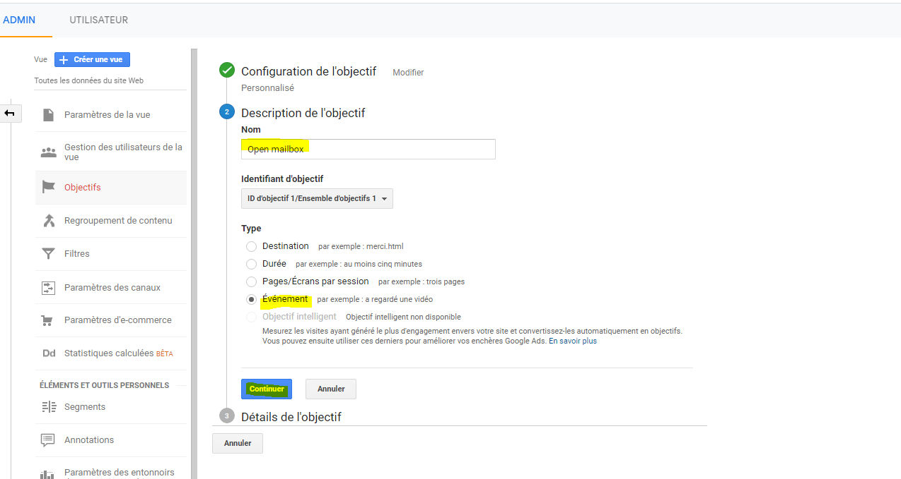


Pour l'étape suivante, il va falloir reprendre très précisément les données reprises sur les tags.

Il faut bien entendu adapter le contenu qui sera encodé avec celui utilisé sur le site.

Ci dessous un exemple :

````
onclick="gtag('event', 'clic', {'event_category': 'to email', 'event_label': 'open-mailbox'});"
````

Catégorie = event_category soit : to email

Action = 'clic' soit : clic

Libellé = event_label soit : open-mailbox

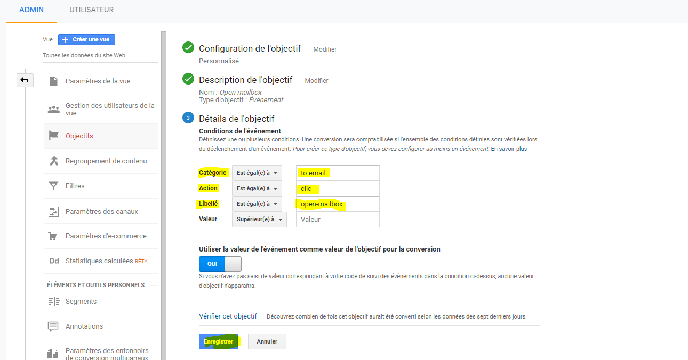


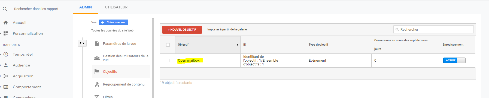


### Analyse des conversions

Dans cette rubrique il est possible de visualiser les différentes conversion en fonction des objectifs définis et ce que ces conversions ont potentiellement rapporté.

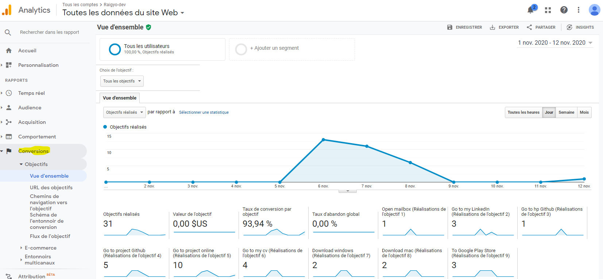


"URL des objectifs" permet de voir depuis quelles pages les objectifs ont été réalisés.

 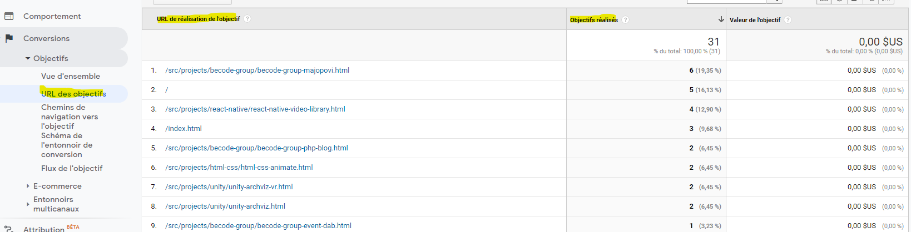


"Chemin de navigation vers l'objectif", comme son nom l'indique, permet de connaître le chemin parcouru sur le site par l'utilisateur avant de réaliser un objectif.

 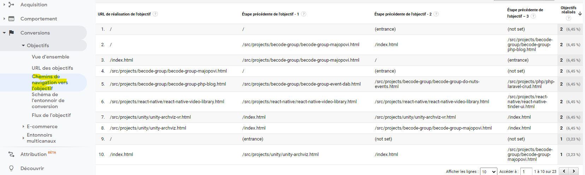

"Schéma de l'entonnoir de conversion" : un entonnoir est un chemin de navigation (succession de pages Web) que vous souhaitez voir suivi par vos visiteurs afin d’atteindre un objectifs du site.

 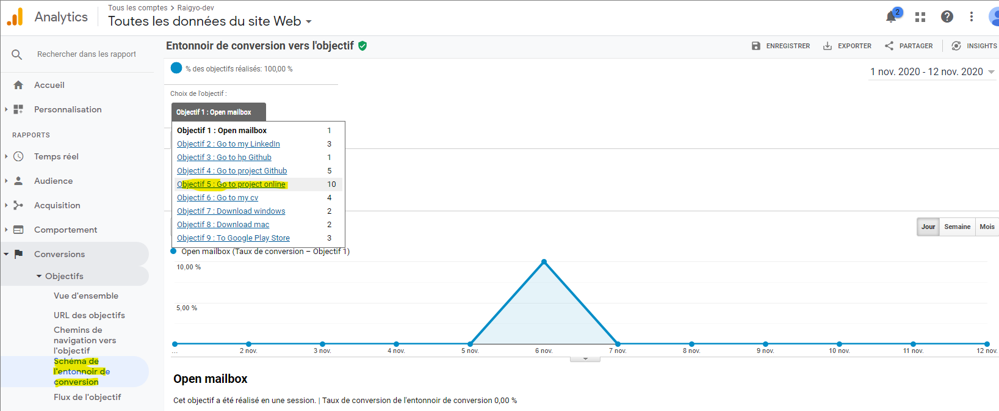

Chaque objectif peut être analysé séparément, et l'on peut voir combien de sessions ont été nécessaire pour accomplir l'objectif..

 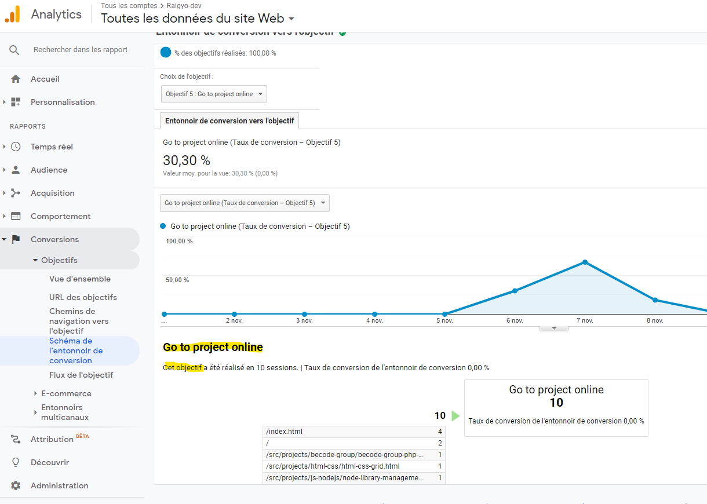

Le rapport "Flux de l'objectif" permet d'identifier si le chemin parcouru par le trafic est interrompu à l'une des étapes de l'entonnoir de conversion.

Les entonnoirs de conversion peuvent être créés lors de la création d'objectifs. Ce réglage permet de voir exactement combien de personnes se déplacent à chaque étape du processus de conversion. Ce processus correspond à un ensemble de pages que vous définissez comme des étapes nécessaires pour arriver à l'URL de votre objectif.

 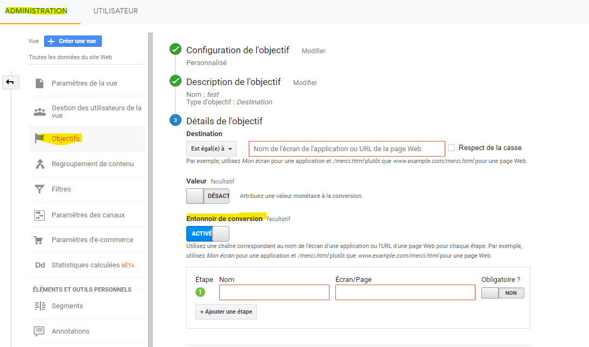

Créer cet entonnoir vous permet de savoir combien de personnes abandonnent chaque étape afin que vous sachiez quelles pages doivent être corrigées ou optimisées. Par exemple, vous pouvez créer un entonnoir de conversion de commerce électronique pour voir combien de personnes se déplacent entre le panier et la page de paiement.

Note: Les entonnoirs de conversion ne fonctionnent vraiment **que lorsque vous demandez à vos visiteurs de parcourir une série de pages précises et que ceux-ci sont bien guidés**. Sauf indication contraire, les visiteurs suivent rarement un chemin clair sur votre site et un entonnoir de conversion ne vous aidera pas à comprendre comment vos visiteurs se déplacent d'une page à l'autre. Pour les chemins avec moins de structure, utilisez le rapport "**Flux de comportements**".


## Liens utiles / sources

- [Formation Udemy: Tout comprendre de Google Analytics et analyser son trafic !](https://www.udemy.com/course/google-analytics-trafic/)
- [Commission européenne: General Data Protection Regulation (EU GDPR)](https://ec.europa.eu/info/law/law-topic/data-protection_fr)
- [Google Analytics : les 10 KPI indispensables](https://fr.ryte.com/magazine/google-analytics-voici-les-10-kpi-les-plus-importants-pour-ton-site-web)
- [ISO 3166 - Codes des noms de pays](https://www.iso.org/fr/iso-3166-country-codes.html)
- [ISO 639 - Codes des langues](https://www.iso.org/fr/iso-639-language-codes.html)
- [emarketing.fr](https://www.e-marketing.fr/)
- [Définitions marketing](https://www.definitions-marketing.com/)
- [anthedesign](https://www.anthedesign.fr/)
- [Qu’est-ce qu’un funnel de conversion ?](https://www.ideagency.fr/blog/entonnoir-conversion)
- [Comment configurer vos objectifs dans Google Analytics](https://digitad.ca/creer-objectif-google-analytics/) 
- [Lighthouse | Tools for Web Developers | Google Developers](https://developers.google.com/web/tools/lighthouse)
- [PageSpeed Insights - Google Developers](https://developers.google.com/speed/pagespeed/insights/?hl=fr)
- [Google Analytics - analytics.js - Site Speed Sample Rate](https://developers.google.com/analytics/devguides/collection/analyticsjs/field-reference#siteSpeedSampleRate)
- [Google Analytics - gtag.js - Site Speed (Page Timing) sample rate increase](https://support.google.com/analytics/thread/7741119?hl=en)
- [Google Analytics - analytics.js - User Timings](https://developers.google.com/analytics/devguides/collection/analyticsjs/user-timings)
- [Google Analytics - gtag.js - User Timings](https://developers.google.com/analytics/devguides/collection/gtagjs/user-timings)


-----


