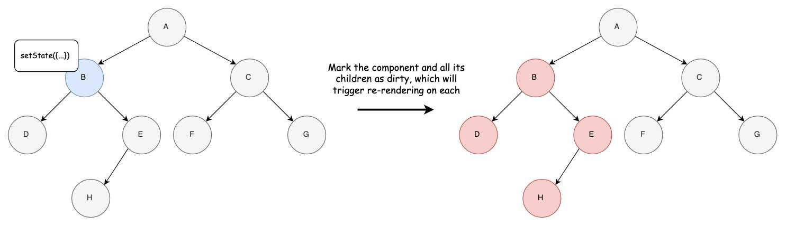
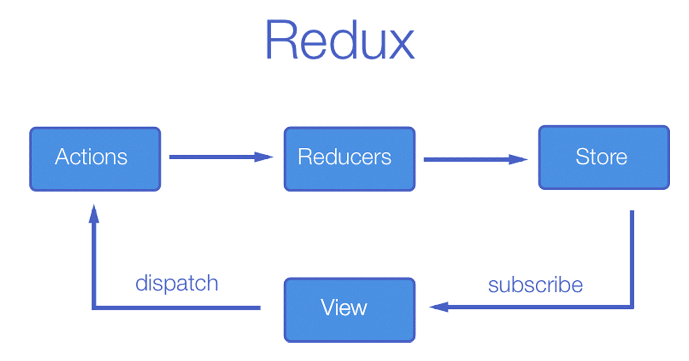

## 1. General concepts

### 1.1 Library vs. Framework

What is a library?

A library is a collection of specific functions that performs simple and small tasks.

What is a framework?

A framework is a collection of specific systematic functions that performs simple and small tasks.


The key difference between a library and a framework is "Inversion of Control". When you call a method from a library, you are in control. But with a framework, the control is inverted: the framework calls you.

In technical terms, a library’s specific function/s is called by the developer while a framework, when called, manipulates the strategic workflow of the developer’s project. In a general sense, libraries are like tools that help you build your desired task. Frameworks however are like templates that will certainly give you your desired output in exchange for specific inputs. This is what we call “Inversion of Control” or IoC.

When you use libraries, you are in control of the strategic workflow of your own projects. However, when you use frameworks, the framework itself is in charge of specific parts of our projects. Therefore, we give the framework control over certain tasks in our project.

One important distinction between libraries like React and frameworks like Ember.js and AngularJS is that React is concerned only with rendering the UI and leaves many things up to each project to put together. As of July 2018, a standard set of tools, often called a stack, for building a React application is as follows:

Application code

- React, Redux, react-router

Build tools

- Webpack, Uglify, npm/yarn, Babel, babel-preset-env

Testing tools

- ESLint, Enzyme, Mocha/Jest

=> **React Is a Library, not a Framework !**

### 1.2 Single page application

Single page application (SPA) is a single page (hence the name) where a lot of information stays the same and only a few pieces need to be updated at a time.

For example, when you browse through your email you’ll notice that not much changes during navigation - the sidebar and header remain untouched as you go through your inbox.

The SPA only sends what you need with each click, and your browser renders that information. This is different to a traditional page load where the server re-renders a full page with every click you make and sends it to your browser.

This piece by piece, client side method makes load time must faster for users and makes the amount of information a server has to send a lot less and a lot more cost efficient.

There are many benefits to SPA solutions such as improved application performance and consistency, and reduced development time and infrastructure costs.

By separating the presentation from the content and data, development teams can work at different speeds while still being integrated for the overall solution. SPA is good for making responsive design for mobile, desktop and tablet.

=> **React is good to develop SPA, but can also be used to make Multiple-page applications**

### 1.3 Component-Based Architecture

Component-based architecture focuses on the decomposition of the design into individual functional or logical components that represent well-defined communication interfaces containing methods, events, and properties. It provides a higher level of abstraction and divides the problem into sub-problems, each associated with component partitions.

A component is a modular, portable, replaceable, and reusable set of well-defined functionality that encapsulates its implementation and exporting it as a higher-level interface.

A component is a software object, intended to interact with other components, encapsulating certain functionality or a set of functionalities. It has an obviously defined interface and conforms to a recommended behavior common to all components within an architecture.

=> **React is a component based architecture.**

### 1.4 JSX

React uses JSX for templating instead of regular JavaScript. It is not necessary to use it, however, following are some pros that come with it.

- It is faster because it performs optimization while compiling code to JavaScript.
- It is also type-safe and most of the errors can be caught during compilation.
- It makes it easier and faster to write templates, if you are familiar with HTML.
- JSX is transpiled in javascript using Babel.

````react
import React, { Component } from 'react';

class App extends Component {
   render() {
      return (
         <div>
            <h1>Header</h1>
            <h2>Content</h2>
            <p>This is the content!!!</p>
         </div>
      );
   }
}
export default App;
````

### 1.5 React Virtual DOM

#### DOM

First things first, DOM stands for “Document Object Model”. The DOM in simple words represents the UI of your application. Everytime there is a change in the state of your application UI, the DOM gets updated to represent that change. Now the catch is frequently manipulating the DOM affects performance, making it slow.

The DOM is represented as a tree data structure. Because of that, the changes and updates to the DOM are fast. But after the change, the updated element and it’s children have to be re-rendered to update the application UI. The re-rendering or re-painting of the UI is what makes it slow. Therefore, the more UI components you have, the more expensive the DOM updates could be, since they would need to be re-rendered for every DOM update.

#### Virtual DOM

That’s where the concept of virtual DOM comes in and performs significantly better than the real DOM. The virtual DOM is only a virtual representation of the DOM. Everytime the state of our application changes, the virtual DOM gets updated instead of the real DOM.

When new elements are added to the UI, a virtual DOM, which is represented as a tree is created. Each element is a node on this tree. If the state of any of these elements changes, a new virtual DOM tree is created. This tree is then compared or “diffed” with the previous virtual DOM tree.

Once this is done, the virtual DOM calculates the best possible method to make these changes to the real DOM. This ensures that there are minimal operations on the real DOM. Hence, reducing the performance cost of updating the real DOM.

#### React Virtual Dom

In React every UI piece is a component, and each component has a state. React follows the observable pattern and listens for state changes. When the state of a component changes, React updates the virtual DOM tree. Once the virtual DOM has been updated, React then compares the current version of the virtual DOM with the previous version of the virtual DOM. This process is called “diffing”.

Once React knows which virtual DOM objects have changed, then React updates **only** those objects, in the real DOM. This makes the performance far better when compared to manipulating the real DOM directly. This makes React standout as a high performance JavaScript library.

#### Rendering elements

*render()* function is the point of entry where the tree of React elements are created. When a *state* or *prop* within the component is updated, the *render()* will return a different tree of React elements. If you use *setState()* within the component, React immediately detects the state change and re-renders the component.

React then figures out how to efficiently update the UI to match the most recent tree changes.

This is when React updates its virtual DOM first and updates only the object that have changed in the real DOM.

TIP: leave React manage the DOM. Do not use ID's, querySelector...

### 1.6 Components and rendering

There are mainly two components in React:

1. Class Component also known as Stateful component
2. Functional Components also known as Stateless component

#### Class Components

Class-based components are the bread and butter of most modern web apps built in ReactJS. These components are simpl classes (made up of multiple functions that add functionality to the application). All class-based components are child classes for the Component class of ReactJS.

````react
import React, { Component } from 'react';
  
class Beginning extends Component 
{ 
    render(){ 
          return <h1>GeeksForGeeks</h1>; 
    } 
} 
  
export default Beginning; 
````

##### States

In class-based components the rendering of components depend on states. Each change of state generates an HTML page or portion of view.



Handling state in class components:

````react

import React, { Component } from 'react';
    
class ClassComponent extends Component {
 constructor(props) {
   super(props);
   this.state = {
     count: 0
   };
 }

 render() {
   return (
     <div>
       <p>count: {this.state.count} times</p>
       <button onClick={() => this.setState({ count: this.state.count + 1 })}>
         Click
       </button>
     </div>
   );
   }
 }
````

##### Props

The main difference between state and props is that props are immutable. This is why the container component should define the state that can be updated and changed, while the child components should only pass data from the state using props.

**App.jsx**

```react
import React, { Component } from 'react';

class App extends Component {
   render() {
      return (
         <div>
            <h1>{this.props.headerProp}</h1>
            <h2>{this.props.contentProp}</h2>
         </div>
      );
   }
}
export default App;
```

**main.js**

```react
import React from 'react';
import ReactDOM from 'react-dom';
import App from './App.jsx';

ReactDOM.render(<App headerProp = "Header from props..." contentProp = "Content
   from props..."/>, document.getElementById('app'));

export default App;
```

##### State and Props

The following example shows how to combine state and props in your app. We are setting the state in our parent component and passing it down the component tree using props. Inside the render function, we are setting headerProp and contentProp used in child components.

**App.jsx**

```react
import React, { Component } from 'react';

class App extends Component {
   constructor(props) {
      super(props);
      this.state = {
         header: "Header from props...",
         content: "Content from props..."
      }
   }
   render() {
      return (
         <div>
            <Header headerProp = {this.state.header}/>
            <Content contentProp = {this.state.content}/>
         </div>
      );
   }
}
class Header extends Component {
   render() {
      return (
         <div>
            <h1>{this.props.headerProp}</h1>
         </div>
      );
   }
}
class Content extends Component {
   render() {
      return (
         <div>
            <h2>{this.props.contentProp}</h2>
         </div>
      );
   }
}
export default App;
```

**main.js**

```react
import React from 'react';
import ReactDOM from 'react-dom';
import App from './App.jsx';

ReactDOM.render(<App/>, document.getElementById('app'));
```

#### Functional Components

Functional components are some of the more common components that will come across while working in React. These are simply JavaScript functions. We can create a functional component to React by writing a JavaScript function. These functions may or may not receive data as parameters. In the functional Components, the return value is the JSX code to render to the DOM tree. If you don't need states, use functional components instead of a class component

````react
import React from 'react';  
import ReactDOM from 'react-dom';  
  
function Demo() 
{ 
  return <h1>Welcome to GeeksforGeeks</h1>; 
} 
  
export default Demo; 
````

##### Hooks

Functional components lack a significant amount of features as compared to class-based components. The gap is made up with the help of a special ReactJS concept called “hooks”. Hooks are special functions that allow ReactJS features to be used in functional components.

````react
import React from 'react';  
import ReactDOM from 'react-dom';  

const FunctionalComponent = () => {
 const [count, setCount] = React.useState(0);

 return (
   <div>
     <p>count: {count}</p>
     <button onClick={() => setCount(count + 1)}>Click</button>
   </div>
 );
};
````

### 1.7 Lifecycle Methods

#### 1.7.1 Lifecycle Methods with Class Components


##### Mounting – Birth of your component

Mounting covers the adding the element to the tree, getting any derived state that it may have, and ultimately the first-pass rendering of the component.

You have access to 4 methods (3 methods and a constructor) that effect the mounting process.

###### The constructor (optional)

Typically, in React constructors are only used for two purposes:

- Initializing local state  by assigning an object to `this.state`.
- Binding event handlers  to a component instance.

````react
class Component {
  constructor(props) {
    super(props); // always call this
    setState({foo: "bar"}); / /never do this
    this.state = {foo: "bar"}; // do this instead
    this.handleClick = this.handleClick.bind(this); // bind is not necessary with arrow functions
  }
}
````

###### getDerivedStateFromProps

getDerivedStateFromProps is a static method that is invoked right before calling Render. This method is intended to be used when you want to set state based off of the value of some props. The react documentation will tell you that getDerivedStateFromProps is designed for rare use cases .

###### Render

Every component needs to have this lifecycle method defined. render is the function that returns what the component displays, and can actually return quite a few types of objects.

The render() function should be pure, meaning that it does not modify component state. Additionally, it should return the same result each time it’s invoked - immutability, and it does not directly interact with the browser (or window).

````react
class Component {
  render() {
    return (<h1>Hello! 👋</h1>)
  }
}
````


###### componentDidMount

componentDidMount is the last method in our “Mounting” category. This lifecycle method is simply called whenever that component has successfully mounted.

The most common use case for this lifecycle method is to load data from a remote endpoint (make an HTTP request). Additionally, if you’re using react programming like RxJS, componentDidMount is where you’d setup any subscriptions.

````react
class Component {
  componentDidMount() {
    fetch('http://example.com/movies.json')
    .then((response) => {
      this.setState({movies: response.json()});
    })
  }
}
````

It’s worth mentioning that you can call setState immediately in `componentDidMount`. This will trigger a second render, but the user won’t see the intermediate state.

https://www.bradcypert.com/understanding-react-lifecycle-methods/

##### Update – Growth of your component

The next phase in the lifecycle is when a component is updated.

A component is updated whenever there is a change in the component's state or props.

###### getDerivedStateFromProps()

getDerivedStateFromProps is triggered once more.

###### shouldComponentUpdate()

In the shouldComponentUpdate() method you can return a Boolean value that specifies whether React should continue with the rendering or not.

The default value is true.

###### render()

The render() method is of course called when a component gets updated, it has to re-render the HTML to the DOM, with the new changes.

###### getSnapshotBeforeUpdate()

This lifecycle method enables your component to capture some information from the DOM before it is potentially changed. Any value returned by this lifecycle will be passed as a parameter to componentDidUpdate().

In the getSnapshotBeforeUpdate() method you have access to the props and state before the update, meaning that even after the update, you can check what the values were before the update.

If the getSnapshotBeforeUpdate() method is present, you should also include the componentDidUpdate() method, otherwise you will get an error.

###### componentDidUpdate()

Last in our “Update” category, we have componentDidUpdate. This lifecycle method triggers whenever a component has successfully updated.

You may call setState() immediately in componentDidUpdate() but note that it must be wrapped in a condition, or you’ll cause an infinite loop.

````react
class Component {
  componentDidUpdate(prevProps) {
    if(prevProps.user.id != this.props.user.id) {
      loadUserData(this.props.user.id).then((user) => {
        this.setState({userData: user});
      })
    }
  }
}
````

##### Unmount – Death of your component

The next phase in the lifecycle is when a component is removed from the DOM, or unmounting as React likes to call it.

###### componentWillUnmount

The `componentWillUnmount` method is called when the component is about to be removed from the DOM.

#### 1.7.2 Lifecycle Methods with Function Components = Life Cycle Hooks

Hooks allow us to write functional React components and still be able to “hook” into all of the `React.Component` functionality, including lifecycle methods.

### 1.8 Higher Order Components 

A higher-order component is a function that takes a component and returns a new component. A higher-order component (HOC) is the advanced technique in React.js for reusing a component logic. Higher-Order Components are not part of the React API. They are the pattern that emerges from React’s compositional nature. The component transforms props into UI, and a higher-order component converts a component into another component. The examples of HOCs are Redux’s connect and Relay’s createContainer.

HOCs functions are pure, which means they are receiving data and returning values according to that data. If the data changes, higher order functions are re-run with different data input. If we want to update our returning component, we don't have to change the HOC. All we need to do is change the data that our function is using.

Two things happen with an HOC

1. Takes a component as argument
2. Return something

Let us take a look at a simple example to easily understand how this concept works. The **MyHOC** is a higher order function that is used only to pass data to **MyComponent**. This function takes **MyComponent**, enhances it with **newData** and returns the enhanced component that will be rendered on the screen.

````react
import React from 'react';

var newData = {
   data: 'Data from HOC...',
}

var MyHOC = ComposedComponent => class extends React.Component {
   componentDidMount() {
      this.setState({
         data: newData.data
      });
   }
   render() {
      return <ComposedComponent {...this.props} {...this.state} />;
   }
};
class MyComponent extends React.Component {
   render() {
      return (
         <div>
            <h1>{this.props.data}</h1>
         </div>
      )
   }
}

export default MyHOC(MyComponent);
````


## 2. React tips and tricks

### When to use states

- Does the data come(s) from a parent component with props?
- Does it stays unchanged during process?
- Can it be calculated using another state or props from the component?

=> 3xNO -> *usually* use states

=> identify in which component(s) the states have to 'live'

### Why use React.Fragment

`<React.Fragment></React.Fragment>` or `<></>`: used if we do not begin with html or if we use invalid DOM in JSX: "Fragments let you group a list of children without adding extra nodes to the DOM."

## 3. Library: REDUX

Redux is a  Predictable State Container for JS Apps.



````react
//Initial state
const initialState = {
  "name": "Vincent",
  "age": 42
}

//REDUCER (state, action)
//Pure: always return a new state
//We use one reducer, but we can use several reducers if needed

const reducer = (state = initialState, action) => {
  //If an action is dispatched
  if(action.type === "INCREMENT_AGE"){
    return {
      "name": state.name,
      "age": state.age + action.payload //payload = data emited
    }
  }
  if(action.type === "CHANGE_NAME"){
    return {
      "name": action.payload,
      "age": state.age
    }
  }
  //Return the new state to the store
  return state;
}

//STORE
//There is only one store
const store = Redux.createStore(reducer);

//Value of global state
store.getState()
// => {"name":"Vincent","age":42}

//ACTION CREATORS
//Functions that take arguments and return an action.

//Action 1 (it will display the state again)
const action1 = {
 type: "INCREMENT_AGE", //type is mandatory
 payload: 3 //properties can have any name
}
// => {"name":"Vincent","age":42}

//Dispatch action1 to reducer
store.dispatch(action1);
// => "type":"INCREMENT_AGE","payload":3}

//New state
//Value of new state in the store
store.getState();
// => {"name":"Vincent","age":45}

//Action 2 (it will display the state again)
const action2 = {
  type: "CHANGE_NAME",
  payload: "Daniel"
}
// => {"name":"Vincent","age":45}

//Dispatch action2 to reducer
store.dispatch(action2)
// => {"type":"CHANGE_NAME","payload":"Daniel"}

//New state
//Value of new state in the store
store.getState();
// => {"name":"Daniel","age":45}

````


## 4. Library: react-router-dom

When you need to navigate through a React application with multiple views, you’ll need a router to manage the URLs. React Router takes care of that, keeping your application UI and the URL in sync.

## 5. React Hooks

## 6. Useful links

- [REACT : 1H POUR COMPRENDRE LA LIBRAIRIE !](https://www.youtube.com/watch?v=no82oluCZag)
- [NOUVEAUTÉ REACT : UTILISER LES HOOKS !](https://www.youtube.com/watch?v=LuxYWWB3_Qc)
- [UTILISER #REACT DANS UN SITE EXISTANT ?!](https://www.youtube.com/watch?v=DrQq-Pu_5iM)
- [React Interview Questions](https://www.interviewbit.com/react-interview-questions/)
- [How React Rendering Works - A Step by Step Guide](https://merictaze.com/posts/how-react-rendering-works-a-step-by-step-guide/)
- [React Functional Components VS Class Components](https://medium.com/wesionary-team/react-functional-components-vs-class-components-86a2d2821a22)
- [Differences between Functional Components and Class Components in React](https://www.geeksforgeeks.org/differences-between-functional-components-and-class-components-in-react/)
- [React Patterns](https://reactpatterns.com/)
- [Understanding React Lifecycle Methods](https://www.bradcypert.com/understanding-react-lifecycle-methods/)
- [React Virtual DOM Explained in Simple English](https://programmingwithmosh.com/react/react-virtual-dom-explained/)
- [React lifecycle methods diagram](https://projects.wojtekmaj.pl/react-lifecycle-methods-diagram/)
- [React Lifecycle Methods – A Deep Dive](https://programmingwithmosh.com/javascript/react-lifecycle-methods/)
- []()
- [Managing your React state with Redux](https://medium.com/the-web-tub/managing-your-react-state-with-redux-affab72de4b1)
- [Codesandbox](https://codesandbox.io/)